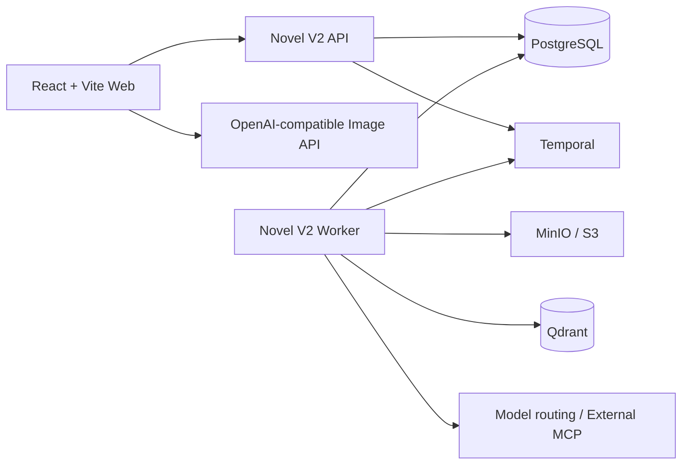

# CreativeStudio

CreativeStudio 是一个面向小说、图像和游戏素材制作的本地优先 AI 创作工作台。

项目把两类工作流放在同一个 Web 界面中：

- **浏览器端创作工具**：AI 生图、抠图、视频抽帧、SpriteSheet 处理和常用图像处理。
- **Novel V2 长篇创作运行时**：从作品定位、故事弧和章节蓝图，到正文生成、审校、修订、事实提取、提交和学习闭环。

图像处理、素材缓存和部分模型推理优先在浏览器中完成；Novel V2 则使用 PostgreSQL、Temporal、对象存储和 Qdrant 保存并执行长流程。调用 AI 时，提示词和参考图会发送到你配置的兼容 API 或外部 MCP 执行器。

> 项目当前处于持续开发阶段，版本号为 `0.1.0`。`视频生成`入口目前是预留能力，不代表完整的视频生成实现。

## 功能概览

### AI 生图

- 文生图和图生图。
- 多张参考图、提示词收藏和模型/尺寸配置。
- 绿幕模式和 N×N 序列帧模式。
- 生成结果可继续送入抠图、素材库或序列帧处理流程。
- 支持 OpenAI-compatible 图像接口，也可以通过项目设置选择自己的 API 地址和模型。

### 浏览器端素材工具

| 工具 | 能力 |
| --- | --- |
| 抠图 | 颜色键、白底去除、容差、羽化、边缘腐蚀和去溢色 |
| 视频转序列帧 | 设置 FPS、时间区间、输出尺寸和帧数，导出 PNG ZIP 或 Sprite Sheet |
| SpriteSheet 拆分 | 等分切片、行列自动检测、内边距调整、PNG ZIP 导出和动画预览 |
| 图像工具集 | 本地超分 4K、格式导出、透明裁切、调色板提取、帧表合成、拼接、像素化和缩放 |
| 素材库/历史记录 | 管理生成结果和处理结果，可重新预览、下载或作为图生图参考图 |

图像 Blob、历史记录和本地超分模型缓存使用浏览器 IndexedDB；不需要为了使用这些本地工具先启动 Novel V2 服务。

### Novel V2 小说创作

Novel V2 的正式章节链路是：

```text
Foundation 全书规划
  -> Story Arc 与章节蓝图
  -> 事实检索与上下文编译
  -> 正文生成
  -> 三类章节审校
  -> 目标修订与审批
  -> 事实提取与去重
  -> commit 与 chapter memory
  -> learning / skill iteration
```

当前主要能力包括：

- 五个 Foundation 规划阶段：`project-positioning`、`architecture`、`characters`、`worldview`、`plot-design`。
- 按故事弧和批次滚动生成 Story Arc，不预先冻结整部长篇章节表。
- 章节蓝图、POV 边界、状态转移、场景执行材料和连续性约束。
- PostgreSQL 词法检索与可选 Qdrant 语义召回组成的长篇记忆层。
- 结构与事实、人物与关系、正文体验与语言三类章节审校。
- 目标修订、局部退化守卫、作者审批、事实提取、章节记忆和技能迭代。
- 已定稿章节从 `review` 阶段重新进入正式审校、修订、事实和提交闭环。
- 内部模型调用和外部 MCP 执行任务；没有配置模型提供方时，任务会持久化并等待外部执行，不会静默生成空正文。

## 技术架构



### 前端

- React 19、TypeScript、Vite。
- Ant Design、Motion、GSAP。
- Zustand 管理界面状态和素材工作集。
- IndexedDB 保存图片 Blob、历史记录和本地模型缓存。
- `src/App.tsx` 定义工作台、AI 生图、小说、素材工具、历史和设置等路由。

### Novel V2 服务端

- `scripts/novel-v2-api.ts`：HTTP API，默认监听 `4770`。
- `scripts/novel-v2-worker.ts`：Temporal Worker，执行持久化创作工作流和活动。
- PostgreSQL：结构化业务数据、审批记录、正文修订和工作流投影的权威存储。
- MinIO/S3：正文等对象内容的存储后端。
- Temporal：长时间运行、可重试、可恢复的工作流执行引擎。
- Qdrant：可重建的语义记忆索引；PostgreSQL 仍保存记忆的结构化来源。
- MCP/模型路由：支持内部兼容 API，也支持把任务交给外部 MCP 客户端执行。

Web、HTTP、MCP 和 CLI 都是可替换客户端。详细数据流见 [`docs/novel-v2/workflow-map.md`](docs/novel-v2/workflow-map.md)。

## 快速开始

### 环境要求

- Node.js。
- pnpm `11.4.0`，版本以 `package.json` 的 `packageManager` 字段为准。
- Docker Desktop 和 Docker Compose v2，用于 PostgreSQL、Temporal、MinIO 和 Qdrant。
- 如果需要 AI 生成能力，还需要一个可访问的 OpenAI-compatible API 或外部 MCP 执行器。

### 一键启动本地开发栈

```powershell
git clone https://github.com/CodeyLife/CreativeStudio.git
cd CreativeStudio
pnpm install
pnpm dev
```

`pnpm dev` 会依次：

1. 启动并等待 PostgreSQL、Temporal、Temporal UI、MinIO 和 Qdrant。
2. 启动 Novel V2 Worker 和 API。
3. 启动 Vite Web 开发服务器。

默认地址：

| 服务 | 地址 |
| --- | --- |
| Web | <http://127.0.0.1:5173> |
| Novel V2 API | <http://127.0.0.1:4770> |
| API 健康检查 | <http://127.0.0.1:4770/health> |
| Temporal UI | <http://127.0.0.1:8088> |
| Qdrant | <http://127.0.0.1:6333> |
| MinIO API | <http://127.0.0.1:9000> |
| MinIO Console | <http://127.0.0.1:9001> |

首次启动需要拉取 Docker 镜像，并执行数据库初始化，因此可能比单独启动 Vite 花费更长时间。

### 只启动前端

如果只需要浏览器端图像和素材工具：

```powershell
pnpm dev:web
```

此模式不会启动 Novel V2 API、Worker 或基础设施。小说工作区需要完整服务栈，AI 生图还需要在设置中配置可用的图像接口。

### 运行完整 Docker 栈

如果希望 API、Worker 和 Web 也由 Docker Compose 管理：

```powershell
pnpm novel:v2:compose
```

该命令会启动 `container` profile 的完整服务集合。它使用独立的 `creative_studio_container_*` 数据卷和 `ymcp-novel-container` bucket，不连接混合开发模式的当前数据。两个模式不能同时占用相同宿主机端口。

### 启动前诊断与迁移审计

```powershell
pnpm novel:v2:doctor
pnpm novel:v2:migrations audit
```

doctor 会检查运行时身份、数据库、迁移头、对象引用、Qdrant alias/维度/点数、Temporal、API 和 Worker。已应用 SQL 的 checksum 漂移不会被静默修复；当前数据的兼容修复只能显式执行：

```powershell
pnpm novel:v2:migrations repair-compatible
```

### 分开运行本机服务

适合调试 API、Worker 或基础设施。先只启动基础设施：

```powershell
docker compose -f docker-compose.v2.yml up --wait postgres temporal temporal-ui minio qdrant
```

然后在三个独立终端中分别运行：

```powershell
pnpm novel:v2:worker
pnpm novel:v2:api
pnpm dev:web
```

也可以直接使用 `pnpm dev` 统一管理本地进程。

## 模型配置

模型路由示例位于 [`config/model-providers.example.yaml`](config/model-providers.example.yaml)。本地配置文件已被 Git 忽略：

```powershell
Copy-Item config/model-providers.example.yaml config/model-providers.local.yaml
```

然后修改本地 YAML 中的 `baseUrl`、模型名和路由，并在启动 API/Worker 的同一终端设置密钥，例如：

```powershell
$env:WEB_CHAT_API_KEY = "your-key"
$env:RESPONSES_API_KEY = "your-key"
$env:SILICONFLOW_API_KEY = "your-key"
pnpm dev
```

也可以通过 Web 设置页或 Novel V2 的模型配置 API 管理路由。不要把真实密钥写入 Git；`.env.example` 只用于查看变量名和本地基础设施默认值。

如果没有配置内部模型，Novel V2 仍可以通过外部 MCP 路由执行任务。相关协议和任务生命周期见 [`docs/novel-mcp.md`](docs/novel-mcp.md)。

## 常用命令

| 命令 | 用途 |
| --- | --- |
| `pnpm dev` | 启动完整本地开发栈 |
| `pnpm dev:web` | 只启动 Vite 前端 |
| `pnpm build` | TypeScript 构建并生成 Vite 产物 |
| `pnpm lint` | 检查前端和运行时 TypeScript 类型 |
| `pnpm test` | 运行 Vitest 测试 |
| `pnpm novel:v2:smoke` | 对已启动的 Novel V2 栈执行冒烟验证 |
| `pnpm novel:skills:validate` | 校验工作区 Novel Skill 定义 |
| `pnpm novel:skills:sync` | 将 Skill 同步到数据库运行时 |
| `pnpm novel:skills:check` | 检查工作区与数据库 Skill 状态 |
| `pnpm novel:skills:explain` | 查看 Skill 来源和装载信息 |
| `pnpm novel:v2:memory:configure` | 配置本地向量记忆档案 |
| `pnpm novel:v2:memory:reindex` | 重建 Novel V2 语义记忆索引 |

建议在提交前运行：

```powershell
pnpm lint
pnpm test
pnpm build
git diff --check
```

需要数据库、Temporal 和模型执行器的集成验证时，再运行 `pnpm novel:v2:smoke`。

## 配置和数据目录

- `.env.example`：基础设施、数据库、对象存储、Temporal、Qdrant 和模型密钥变量示例。
- `config/model-providers.example.yaml`：模型提供方和任务路由示例。
- `config/model-providers.local.yaml`：本地模型路由，不提交到仓库。
- `deploy/postgres/`：PostgreSQL 迁移脚本。
- `.data/`：本地运行数据目录，默认不提交。
- `dist/`：Vite 构建产物，默认不提交。

Novel V2 默认使用本地 MinIO 作为对象存储。运行时会校验对象存储身份，避免同一个数据库被错误地切换到另一套存储配置。更多运行时约束见 [`docs/novel-v2-runtime.md`](docs/novel-v2-runtime.md)。

## 文档索引

- [`docs/novel-v2-runtime.md`](docs/novel-v2-runtime.md)：本地服务栈、环境变量、HTTP 表面和运行时边界。
- [`docs/novel-v2/workflow-map.md`](docs/novel-v2/workflow-map.md)：Novel V2 工作流和阶段契约。
- [`docs/novel-v2/quality-standard.md`](docs/novel-v2/quality-standard.md)：长篇创作质量标准和审校维度。
- [`docs/novel-v2/pipeline-audit.md`](docs/novel-v2/pipeline-audit.md)：当前流程审核、回归边界和验证矩阵。
- [`docs/novel-v2/prompt-skill-audit.md`](docs/novel-v2/prompt-skill-audit.md)：Prompt 与 Skill 的审计和发布流程。
- [`docs/novel-v2/research-methods.md`](docs/novel-v2/research-methods.md)：创作研究方法和系统转译边界。
- [`docs/novel-mcp.md`](docs/novel-mcp.md)：外部 MCP 执行协议。
- [`CONTEXT.md`](CONTEXT.md)：小说创作领域术语和数据边界。
- [`AGENTS.md`](AGENTS.md)：仓库协作、验证和架构约束。

## 当前边界

- `video-gen` 目前为预留导航入口，完整视频生成能力尚未作为已交付功能记录。
- Novel V2 依赖 PostgreSQL、Temporal 和对象存储；它不是只打开静态 Web 页面就能运行的离线功能。
- Qdrant 只承担可重建的语义索引，不能替代 PostgreSQL 中的事实、来源和审批记录。
- 旧的 V1 小说运行时不是 Novel V2 的兼容目标；新功能应使用 `/v2/*` API 和当前 Novel V2 工作流。
