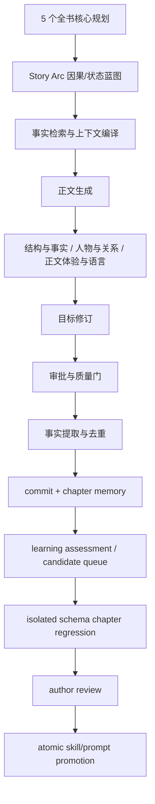

# Novel V2 小说创作工作流

> 当前活动契约：2026-08-04。本文以源码和当前 workflow 行为为准；历史 artifact、已完成旧审校记录和旧 reflection 数据只读保留，不被新运行消费；不兼容的活跃审核运行可直接终止并废弃未提交候选。

运行数据卷、仓库更名后的恢复步骤、正式审校边界和质量 A/B 产物契约见 [data-recovery-quality-validation.md](./data-recovery-quality-validation.md)。混合开发模式使用稳定命名的 `creative_studio_novel_*` 卷；卷不存在时由 Compose 创建，不能通过切换到另一组卷来伪造空库。全 Docker profile 使用隔离的 `creative_studio_container_*` 卷，不连接混合模式当前数据。

## 1. 目标流程



Web、HTTP、MCP、CLI 都是可替换客户端。PostgreSQL 保存结构化真源，Temporal 持有 durable execution，正文对象通过对象存储保存，Qdrant 只承担可重建索引。

章节正式链路固定为：

review → revise → manuscriptApproval → extractFacts → approveFacts → commit → enrichCharacters

没有新的 reflection activity、reflection schema 或 reflection artifact 消费路径。旧 reflection 产物可以查看和审计，但不参与新 draft、review、revision 或 commit。

## 2. Foundation 全书规划

活动阶段只有五个：

| taskKey             | 职责                   |
| ------------------- | -------------------- |
| project-positioning | 项目定位、读者方向、核心承诺与作者边界  |
| architecture        | 全书结构、卷级层次、长期状态与收束方式  |
| characters          | 主要人物、动机、声部、知识边界与关系可能 |
| worldview           | 世界事实、规则、代价和可验证边界     |
| plot-design         | 长程主线、支线、信息释放、伏笔和终局策略 |

依赖关系：project-positioning → architecture / characters / worldview → plot-design。旧 relations、plot-threads、foreshadowing、timeline、story-control 不再生成独立 task；相关信息可作为上述五阶段 payload 的可选结构存在。

每个 Foundation artifact 保留 artifact id、fingerprint、source provenance、审核和作者确认状态。可选结构不转换为固定数量、逐章字段或每章质量门。生成失败、编辑、重生成和上游 stale 仍由原有 section 生命周期和审计记录管理。

provider 端 `foundationSchema` 只校验 `structuredData` 是 JSON 文本字符串，无法表达 task 级容器键（如 `architecture` / `worldview`）。`structuredData` 根形态采用平铺契约：对象型 task（project-positioning / architecture / worldview / plot-design / plot-threads / timeline / story-control）的根直接承载 task 数据，不再包一层与 task 同名的容器键；数组型 task（characters / relations / foreshadowings）的数据本质是数组，但 `structuredData` 根必须是对象，因此保留 `{ [collectionKey]: [...] }` 集合容器（provider 与解析层都要求根为对象）。`normalizeFoundationModelOutput(value, taskKey)` 在最低共享层做形态归一：对象型 task 根含 `dataRoot` 容器键（历史容器或模型遵守旧契约）时解包为平铺，已平铺则保持不变；数组型 task 保持集合容器。判定基于纯结构特征（dataRoot 键与 schema type），跨 provider/题材复用；根是其他 task 容器或内容确实缺失时不误解包，契约校验仍如实报告，避免掩盖内容问题。该归一化在生成与 external-mcp 物化两条路径同时生效，保证落库 artifact 始终是规范平铺形态，历史容器数据在读取侧（全书审计、书名读取）同样被解包。

### 2.1 角色身份与展示投影

Foundation `characters[]` 中的 `id` 是项目内规范人物 ID，`name` 是作者可读的展示名。`entities.id` 只保存稳定关联键，`entities.name` 与 `payload.displayName` 保存展示名；角色富化和关系写入必须先通过项目内身份映射解析规范 ID、中文/原文名称和实体 ID，不能把模型返回的稳定 ID直接当作展示名。已有 Foundation 映射优先于自然语言别名，未知的关系目标创建为 `pendingEnrichment=true` 的待补全实体，不推断或伪造正式角色名。知识工作台读取角色时合并 Foundation 基线与实体增量，展示名优先，规范 ID 只作为可追溯副信息。

### 2.2 全书架构审计与正文审校分层

全书架构审计发生在 Foundation 与 Story Arc 之间，审计对象是跨阶段结构数据，不是当前章节正文。`auditFullBookArchitecture` 只检查以下共享契约：

- architecture：每卷的入口状态、阶段压力、退出状态和承诺窗口；

- characters：重要人物的限制/恐惧、独立行动与选择代价；

- worldview：规则陈述、调用代价和不可越过的边界；可选资源/技术分配（resourcesAndTechnology）与价值/冲突（valuesAndConflicts）压力层；

- plot-design：人物终点引用、长线阶段责任/下一次推进和信息边界。

长线（longHorizonThreads）可携带可选的 `coupling`（与主线的耦合机制：改变人物选择/资源/认知/关系/世界规则之一）和 `mergePoint`/`exitPoint`/`transformPoint`（交汇/退出/转化条件）。缺方向、结局、阶段责任等必需契约仍产生 major；只缺耦合机制或生命周期条件的线产生 `long-horizon-thread-coupling-incomplete` warning，不阻断审批，旧数据不因缺少这些可选字段失效。`architecture.structureType` 是可选的 `linear | tree | network` 枚举，只描述结构与承诺的匹配理由，不作为质量门。

故事弧只持久化 `threadResponsibilities`，每条责任的 `threadRef` 同时承担剧情线引用和本弧的下一次可验证推进条件。不存在可独立维护的 `plotThreadRefs` 名单；暂缓的剧情线可以记录保持/观察责任，不把长线变成逐章兑现清单。

重基线 envelope 携带符合当前契约的 `approvedArc`、历史章节提交包和事实证据。章节冻结权威仍来自章节提交包、`chapterMemory` 和事实证据。缺少可验证责任的旧弧在迁移中标记为 stale，不能由运行时静默推断或投影为新契约，必须重新生成并审核故事弧。

审计报告以 `fullBookArchitecture` 独立返回，保留 volumeCount、estimatedChapterCount、characterCount、longHorizonThreadCount 和结构问题列表；缺少或为空的 architecture.volumes、characters.characters、worldview\.rules、plotStrategy.characterDestinations 或 plotStrategy.longHorizonThreads 会产生 major。卷级 `promiseWindows` 除数组存在性检查外，还做内容软诊断：条目缺少可解析引用（promiseRef/id/description）或阶段窗口（windowOrdinals/window/payoffWindow）时报告 `promise-window-ungrounded` warning，不阻断审批。它不读取正文质量分，也不要求每章出现事件、钩子、反转、主题、感情或幽默。`architecture/health.issues` 继续负责批次重叠、已提交剧情线和伏笔引用等硬完整性问题。

两类问题的处理入口不同：Foundation 契约缺失先修 Foundation 并使受影响故事弧 stale，再通过弧级 rebase 重新编译阶段计划。rebase 先严格校验新候选，再覆盖已提交章节的冻结蓝图；历史章节以 `revisionId` 或 `chapterMemory` 的生命周期身份识别为冻结权威，不依赖新旧 JSON 完全相等。只有当架构契约已经成立、问题仍具体表现为当前段落的场景因果、视角、人物行为或语言时，才进入 `chapterReviewWorkflow`。章节正文审校不能替代全书架构审计。

Foundation 审核（`foundation.book-plan` 执行点，`foundation-reviewer` 角色）在既有契约完整性、层级因果、多线耦合与不确定性检查之外，以目标读者视角加查十项基线（由 `review-gate` Skill 与 foundation-review prompt 共同承载）：承诺可兑现（卖点是可体验的冲突组合而非名词堆）、主题进入选择（主题落在人物利益/关系/责任/代价的具体选择上）、欲望-阻力-选择-代价闭环、配角独立欲望与关系网络、世界观规则改变人物可选集合（删掉设定名词后选择是否不变）、感情线靠行动累积而非宣言、重复与升级是否改变层级/意义/代价、读者不确定性是否有可推断证据、表层大众化（卷名/章节名/概念与术语命名面向大众读者，专业概念出现在表面时须转译且全篇同译名）、揭示物分层（核心创意与世界观真相是剧情揭示物而非开篇设定，规划区分世界表面事实/异常现象/底层真相，删除真相后开局仍须成立）。十项是检查方向与证据类型，不是必须全部成立的硬门：按当前 taskKey 的适用性选择，不适用项跳过，不因缺少某项扣分，只有缺失确实损害已承诺功能时才产出审核意见并驱动修订。审核仍不要求每章事件、钩子、反转、主题、感情或幽默，也不通过增加固定章节数量、固定爽点密度或强制感情线来修复问题。

规划级审核（Foundation 与 Story Arc）采用文本意见契约（`src/novel-v2/text-review.ts`）：通过时模型只输出单行 `PASSED`，不通过时输出可执行审核意见全文，意见本身即「不通过」信号；verdict 只保留 `passed`/`revise` 二值，不再有 `blocked`。设计依据：规划级审核产出本质是指导意见，强结构化枚举（维度分数、逐章校验账本、authorityChecks）依赖 provider 真正执行 strict json\_schema，第三方中转站可能忽略该字段导致模型自由发挥、修复循环仍失败；文本契约对任何 provider 零依赖。审核不通过时，意见作为重新生成的 `instruction` 回流（Foundation 经 `reviseWork` 写入 work item instruction 由 `buildFoundationPrompt` 消费；Story Arc 经 `buildStoryArcRevisionPrompt` 注入修订 prompt），learning 评估以同一意见为输入。解析基于结构特征（单行标记/围栏剥离），跨题材与模型复用。

## 3. Story Arc 与章节蓝图

Story Arc 按故事弧和批次滚动生成，不在开篇冻结整部长篇章节表。章节蓝图的活动字段是：

| 字段                    | 用途                               |
| --------------------- | -------------------------------- |
| index / title         | 叙事顺序和工作标题                        |
| narrativeFunction     | 当前章节的叙事功能，可为空或由模型选择              |
| povCharacterId        | POV 边界                           |
| stateTransition       | before、after、evidence，允许外部状态保持稳定 |
| scenes                | 当前执行场景                           |
| continuityConstraints | 冻结事实和连续性边界                       |
| unresolvedAtClose     | 章节结束后仍未解决的事项                     |

场景只保留 title、participants、situation、observableActions、opposition、decision、outcome、cost。opposition、decision、cost 允许为空；安静、关系、背景、等待、恢复、内省和余波章节不必被改造成冲突升级。

删除的章节级编辑字段包括 summary、chapterPurpose、readerExperience、thematicTreatment、romanceTreatment、humorTreatment、dramaticQuestion、emotionalMovement、stateDeltaBudget、narrativeScale、optionalBeats、setupRefs、payoffRefs、closingForce、freedom、participantStakes，以及旧版 goal/turn。041 迁移清理这些 JSONB 字段，新的生成、编辑和正文 prompt 只读取 `chapters.payload` 的 canonical blueprint。

Story Arc 审核只检查状态连续、场景因果、事实权威、章节功能与长篇位置是否相容：审核 prompt 要求按整弧与逐章清单完整覆盖（每章的状态连续、场景因果、章节功能、权威边界，整弧的阶段边界/窗口节奏/长篇层级），输出为文本意见而非结构化账本（见上文规划级审核文本契约）。它不要求每章新事件、外部压力、强钩子、反转、爽点、主题表达或不可逆变化；审核完整性不等于正文创作约束。

弧规划由 `story-arc-design` Skill 提供设计契约（execution points：arc.plan / arc.review / arc.revision / chapter.blueprint），把弧视为"一个读者问题被逐级回答并升级"的叙事单元而非章节状态序列。五项设计契约：问题阶梯（主线推进弧的核心读者问题在 development 中逐级被回答并升级）、压力类型轮换（连续同类压力必须升级规模、代价或牵连）、场景因果链（场景 outcome 成为下一场景 situation 的触发条件；不推动外部因果的场景必须承担关系温度/理解修正/余波承载或独立体验功能，否则视为赘余）、安静章功能（无外部事件章节必须让读者获得可感知的新东西——关系温度变化/风险判断改变/物品易主/理解修正/情绪确认/余波承载之一；确认规则的陈述若改变角色后续选择或风险判断即算功能）、不可逆出口（推进型弧 exitState 相对 entryState 至少一项不可逆变化；铺垫/过渡弧出口可稳定但须说明静态功能）。弧审核另加读者回报检查：本弧 entryState/objective 承诺的体验（解决问题、关系升温、世界揭秘、认知落差、情绪确认）是否在 exitState 与 development 中真正交付；弧结束时读者只经历过程而无解决、成长、理解、情绪或新问题中的任何回报时报告为节奏问题，安静弧的回报可以是理解修正或关系温度。这些契约是弧级检查方向与证据类型，不是必须全部成立的硬门：安静、关系、背景、铺垫和余波弧与行动弧同样合法，只要功能有可感知证据；只有契约缺失且确实损害本弧承诺功能时才按 major 报告。规划 prompt 同步承载同一契约的压缩表述；章节级 quiet chapter 仍可通过关系温度、理解、信息分布、情绪或余波完成功能，不必被改造成冲突升级。

**外部编排模式（模式 B）**：故事弧规划另有外部编排入口 `novel_story_arc_orchestrate`，由外部大模型或用户提供剧情编排（plotOutline：objective 必填，其余为弧级设计意图——entryState/centralConflict/development/resolution/exitState/threadResponsibilities/expectedChapterCount/phases/chapterHints/plotNotes），系统负责完善：把编排作为 `arc-context-plot-outline` required section 注入 arc.plan / chapter.blueprint / arc.review / arc.revision 执行点，对照冻结事实与叙事状态账本做事实梳理，补全场景因果、章节状态转换、连续性约束与责任承接，再走正式弧审核 → 修订闭环。编排是设计意图基线，权威低于已定稿事实、叙事状态账本与作者边界：冲突时以事实为准，不得为了贴合编排虚构事实、提前消费后续答案或改写人物知识边界；空编排（只有 objective）被拒绝，提示改用普通模式。编排输入持久化在 `workflow_runs.payload.plotOutline`（`arcs.payload` 在项目蓝图投影时会被 bundle.arc 覆盖，不能作为编排持久化位置），并写入蓝图 artifact structuredData 提供 provenance；后续批次与审校通过 `getStoryArcPlanningInput(projectId, arcId)` 按弧精确读取同一份编排。外部任务降级路径在 contextRefs 中携带 outlineJson，物化时写回 artifact。编排含 threadResponsibilities 时沿用 threadRef/responsibility/nextAdvance 契约，未解析引用仍按提交边界阻止批准。

审核 pass 之间相互隔离，并受 `NOVEL_ARC_REVIEW_PASS_TIMEOUT_MS` 的单 pass 超时预算约束（默认 120000ms；TODO：迁入持久化模型路由合同）。单个 provider、视角或结构结果失败时记录丢弃视角元数据；若仍有完整审核结果则继续聚合，只有零个完整结果才失败。已有 blueprint 的失败弧按批次状态自动恢复，`awaiting-review` 批次的语义统一为"引用当前蓝图的批次"（`source_artifact_id = blueprint_artifact_id`，与 `prepareStoryArcReviewRetry` 前置条件一致）：存在引用当前蓝图的 `awaiting-review` 批次时通过正式 retry 状态转换重新进入审核（重审原蓝图，不重新生成）；无引用当前蓝图的 `awaiting-review` 批次（批次已 approved，或批次引用旧蓝图属过期残留）时通过 `prepareStoryArcRebase` 恢复为 `awaiting-review` 并保留蓝图，由入口的 rebase 判定（无待审批次 + 覆盖已提交章节）进入冻结历史 rebase 路径。两类恢复前置条件精确互补，修复了 failed 弧 + approved 批次永久死锁及批次引用错位使 retry/rebase 双双拒绝的死锁边角；`prepareStoryArcRebase` 只负责把 failed 弧恢复为 `awaiting-review`（审计 `story-arc.review-recovered`，recovery=rebase-prepare），无已提交章节时入口的 rebase 判定为 false，工作流实际对旧蓝图做普通复审（修订仅在审核失败时触发，蓝图保留），真正 rebase 决策记录在 workflow run payload 的 rebase 字段。MCP 通过 `novel_story_arc_review` 暴露统一恢复入口，客户端不能用“启动下一故事弧”替代失败弧恢复。若当前弧已有前批次定稿章节但还存在待审核的后续批次，审核只针对该新增批次走普通审核路径；只有没有待审核批次且审核对象确实覆盖已提交章节时，才进入冻结历史 rebase，避免把前批次位置误套到后续批次。

rebase 重基线时，已定稿（committed）章节的蓝图严格对齐已提交版本、只修正 index；planned 章节（只有已批准的未来蓝图、尚无正文）允许以模型新生成内容为准更新标题/场景/证据等读者可见字段，但 `unresolvedAtClose` 必须保留自已批准蓝图，防止修订悄悄改变跨章承诺，`validateStoryArcRebaseBundle` 仍要求该章节有 plannedBlueprint。MCP 模式下 rebase 自动 approve，因此已批准 planned 章节的读者可见字段可被重基线静默改写；这是"宏观规划变更后重基线"的既定语义，作者若已认可旧蓝图内容需在重基线前显式保留。

故事弧规划、审核和下一批次入口在同一项目/故事弧范围内持有 PostgreSQL advisory lock，锁覆盖状态检查、workflow\_runs 登记和 Temporal 启动，避免重复请求绕过状态检查并产生并行工作流。入口在状态变更或 Temporal 启动失败时把已登记运行标记为 failed，并通过正式恢复状态转换回收 generating 故事弧或 generating 批次；锁只保护 admission，不替代工作流自身的状态机。放弃故事弧也在同一锁内读取活动运行，先持久化弧的 abandoned 状态，再取消对应 Temporal workflow、标记运行 cancelled 并过期其外部模型任务；取消失败只保留警告，不阻塞故事弧的本地放弃。

已批准且仍在执行的故事弧按批次继续规划；MCP `novel_story_arc_batch_start` 先通过 `prepareNextStoryArcBatch` 分配不重叠的下一章节区间，再复用同一套故事弧规划、审核、修订和提交工作流。若模型服务失败，调用方必须以 `retryFailed=true` 走同一工具的正式重试状态转换；`prepareStoryArcBatchRetry` 只恢复没有章节投影的最近失败批次，并保留失败原因和重试审计，不创建伪造的后续批次。它不绕过当前弧的 `exitState`、已定稿章节冻结和批次完整性校验，也不允许客户端直接伪造下一批章节蓝图。

故事弧模型 activity 的 Temporal 重试上限为 1，因为一次 activity 内的 gateway 已按 routing snapshot 完成候选切换和失败审计；activity 级重复会再次消耗全部候选并掩盖“路由耗尽”的终态。失败批次不会自动伪造新窗口，作者/客户端必须通过 `retryFailed=true` 显式恢复，确保重试有边界且可追溯。

审核 prompt 还对相邻章节的持续状态做通用反向核对：物件、伤势、资源、关系、知识和限制的身份变化必须有可验证的丢失、转移、消耗、恢复或新证据。对未知物质、装置、痕迹或局部反应，湿度、颜色、气味、声音、光亮或接触变化只能支持当下现象，不能单凭一次反应推出用途、成分、机制或功能；越过这条边界的蓝图主张必须在审核意见中明确指出并要求修订保留未知状态。故事弧按批次滚动审核；未完成批次不要求当前章节证明未来 `exitState`，弧级审核检查的是当前窗口与阶段边界、长线责任和后续空间是否相容。审核完整性（逐章覆盖、证据边界、确定性升级防越界）由审核 prompt 的检查清单要求模型逐项覆盖，不再以机器账本强制；审核意见中的问题必须引用实际蓝图字段或章节证据，并在修订中最小化修复。它是弧级状态契约，不是正文句式黑名单，也不将每个名词变成逐章必填项。

## 4. 上下文编译

ChapterPlanningContext 只保存：

- 当前章节执行合同和 artifact 引用；

- 当前章节状态边界、场景执行材料和连续性约束；

- 相邻章节的 narrativeFunction 与状态边界；

- fingerprint、source provenance 和必要的事实投影。

它不保存完整宏观规划 payload。正文阶段通过 memory claims 获取冻结事实，不通过蓝图重复注入世界观、主题和人物标签。draft、review、revision 共用 renderChapterExecutionContract，避免三套 prompt 对同一蓝图各自解释。

章节工作区的 `chapter_production_specs` 只保存作者明确输入的 `chapter_goal`；蓝图、来源 artifact 和指纹统一从 `chapters.payload` 及其来源 artifact 投影。`NarrativeStateSnapshot` 只保存弧阶段、开放线程、伏笔、承诺、兑现节点和提前消费边界；summary、keyEvents、characterStates 只由 `ChapterMemory` 持有。开放伏笔记录可携带 readerQuestion、possiblePayoffs、meaningDelta、cost 四个可选规划字段（缺失按未指定处理，不作为逐章必填），供故事弧把兑现方向与代价作为可排序候选；这些字段来自 fact-extraction 的结构化提取，属于设计态而非叙事事实。

NarrativeRhythmEntry 只保留 documentId、revisionId、narrativeOrder、title、narrativeFunction。summary、keyEvents、emotionalArc、主题字段和 issue families 不再作为章节节奏输入。

跨章序列证据（`SerialContextSnapshot`，`MemoryBundle.serialContext`）把最近 N=6 章的结构化统计投影给 draft/review/revision/learning，弥补单章审核结构上看不见跨章模式的问题（状态等幅重述、连续同功能章节、物件/主题跨度）。它由 `getSerialContextSnapshot` 确定性计算（无 LLM），只输出描述性统计信号，不输出短语黑名单："角色状态跨度"来自各章最新 `ChapterMemory.characterStates`，"连续同类功能"来自 `chapters.payload.narrativeFunction` 的连续游程（≥3），"物件/主题跨度"来自 memory\_claims 中出现在 ≥2 个窗口章节的 subject\_refs。"母题还是疲劳"的判断（重复必须改变层级/意义/代价）由 reviewer 依正文证据作出；窗口与游程阈值为魔法值，标注 TODO 可配置意图。该投影与 narrative rhythm 同级（priority=normal，可被预算淘汰），不影响事实可靠性边界。

上下文编译仍保留 required/normal/critical 优先级、输入预算、manifest、prompt fingerprint、source artifact id、Skill provenance 和可审计排除记录。事实、人物知识边界、当前 POV、起始状态、结束状态和场景因果是可靠性边界；文学偏好不转成必填字段。记忆选择区分两层：叙事状态账本和 required facet 是当前阶段的硬上下文，开放伏笔/承诺是可排序候选；它们仍可被检索和回收，但不会因为“开放”就全部挤占 pinned 预算或把局部正文变成清单执行。

文风契约（`style_contracts` 表）是书级、可版本的叙述声音约束：十维滑杆（POV、叙述距离、时间方式、句式节奏、词汇层级、感官重心、比喻密度、对白比例、留白程度、叙述态度）以 JSONB 按版本保存，同一项目至多一个 `active` 版本。draft/review/revision 通过 retrieveMemory 读取 active 契约，作为 `style` facet 的可排序候选注入（ranked-fill，可被预算淘汰，不冻结）。契约是 prose-reviewer 与写作者的对照参考基线，不强制每章逐维满足，也不把任何取值变成质量门；缺失维度按未指定处理，旧项目无契约时静默降级。

Story Arc 的规划输入使用结构化反馈投影，而不是把 narrative state 原样 JSON 倾倒给模型。投影包括开放剧情线 payload、开放伏笔/承诺的规范 ID、最近定稿章节状态和与规划/连续性/因果相关的 RuntimeLearning underlyingMechanism、affectedInputClass、边界。模型输出契约不再包含 `authorIntent`、`thematicQuestions` 或 `phases[].exitCondition`；`authorIntent` 只作为请求上下文参与规划。review/revision 使用独立的 context sections，并在 manifest 中记录 `narrativeCutoff`、来源 artifact/revision、section fingerprint 和总 fingerprint；旧 planning 数据标为 legacy provenance。反馈只提示共享机制风险，已定稿事实、叙事账本和作者边界仍具有更高权威，开放线索也不等于本批次必须兑现的事件。

模型请求的结构化契约由 gateway transport 统一投影：Responses 使用 `text.format`，Chat Completions 使用 `response_format.json_schema`。发送前的 native schema 预检拒绝 optional properties、动态或空 object、`additionalProperties: true` 及 `anyOf/allOf/oneOf` 等不稳定组合关键字；失败分类为 schema incompatibility，只切换下一个原生候选或外部 MCP。Schema 不再注入 prompt，所有返回仍经过同一 AJV、业务语义校验和修复循环。故事弧规划拆为 arc+batch 与 chapters 两个原生请求，只有两段均完成并通过业务校验后才组装并创建 artifact；draft、review、revision 统一使用 `StagePromptPackage`，三个 reviewer 并行启动。

`model_invocations` 同时保存 provider input/output tokens 与 provider 返回的 cached input tokens（若供应商提供）；没有 provider 用量时仍保留估算值并标记 `usage_source`，不把估算值伪装成真实计费数据。每次调用还保存 `config_revision`，章节审校和故事弧工作流都在进入模型阶段前冻结 `routingSnapshot.id` 并写入运行 payload；因此可以区分“当前配置”与已启动运行使用的“历史路由快照”。路由解析优先使用显式 purpose（如 `review.structure`），再回退到同前缀通配路由（如 `review.*`），最后才回退到 `*`；设置页必须显示解析来源和快照短 ID。provider 能力探测会临时固定单个 provider，只证明该 provider 的传输/协议契约，不代表真实候选链的顺序或 fallback 结果。候选链表示有序尝试计划，实际 provider/model 必须以调用审计为准；一次成功请求或最终失败前，网关可能已经按候选序号逐个留下失败记录。每次失败调用还保存 `provider_label`、`error_category` 和截断后的 `error_message`，总览通过 `/v2/projects/:projectId/model-invocation-errors?limit=50` 展示该项目最近 50 条失败，按 `created_at DESC,id DESC` 排序；工作流页通过 `/v2/runs/:workflowId/model-invocations` 展示该次运行的实际 provider/model/protocol、候选序号、状态和路由快照短 ID，不再从当前配置反推历史请求。`workflowId` 是数据库/Temporal 工作流标识，Temporal `runId` 只是一次执行尝试，不能混用；历史记录若没有响应正文，只显示“历史记录未保存 provider 返回正文”的明确占位说明。
事实抽取的模型契约顶层只返回 `facts` 与 `narrativeElements`；事实对象的 `value` 始终是字符串，数字、布尔值和 JSON 通过规范化 JSON 文本传输，再由应用层按 `object.kind` 解码。`ChapterMemory` 与角色富化继续使用独立流程，章节状态快照不再复制摘要、事件和角色状态。模型路由耗尽错误同时登记 `NonRetryableModelTransportError` 与其可能的 Temporal 序列化类型 `ModelTransportError`，确保运行进入失败/人工可见状态而不是长时间停留在 `running`。

### 架构体检与引用边界

`GET /v2/projects/:projectId/architecture/health` 是只读诊断入口。它汇总 Foundation 批准状态、故事弧批次区间、章节定稿状态，以及剧情线/伏笔引用的规范 ID、兼容别名、未知项和歧义项；同时返回独立的 `fullBookArchitecture` 结构审计。章节 `planned` 表示蓝图尚未关联正文，或已关联但正文仍为 planned；`orphaned` 只表示无故事弧、关联正文不存在，或已批准故事弧仍缺正文。审批前故事弧下的正常蓝图不计为 orphaned。诊断不会改变正文或章节蓝图。

章节生命周期有两个持久化投影，但权威只有一处：`manuscript_documents.status='final'` 且存在 `current_revision_id` 表示正文已经定稿；`chapters.status` 是故事弧查询和规划索引使用的反规范化标记。正文 commit、手工保存、版本恢复都必须在同一事务中把关联 `chapters.status` 回填为 `final`；故事弧重基线不得让受保护的已定稿章节回退为 `planned`。读取 Story Arc 时还要从关联 manuscript 投影出 `final`，作为历史脏数据和失败重基线的防御性兜底。迁移 `037_chapter_status_projection.sql` 修复章节状态不一致，迁移 `039_story_arc_completion_projection.sql` 修复“最后批次已完成且所有章节已定稿、但故事弧仍为 active”的生命周期投影，迁移 `040_story_arc_completion_projection_failed_attempts.sql` 进一步处理后续失败尝试覆盖已批准完成批次的情况；完成判定必须排除未关联或无当前 revision 的章节，并允许最后批准批次的 `endChapterIndex` 已覆盖 `expectedChapterCount` 时修正模型遗漏的 `complete=false`。生成入口以 `manuscript_documents` 的正文状态决定是否可生成，不能仅依据蓝图状态；MCP、HTTP `/v2/intents` 与 `novelIntentWorkflow` 统一调用 `assertChapterGenerationAllowed`，定稿章节必须转入 `chapterReviewWorkflow`，不得创建新的生成工作流。

历史 schema 收敛由 append-only migration 完成：可验证的旧 artifact 映射为 `review` 或 `chapter-blueprint`，无法判定的记录失效；旧活动 workflow 标记为 `needs-restart`，缺少责任契约的故事弧标记为 `stale`。运行时的 `normalize-references` 只处理当前 `threadResponsibilities` 和伏笔规范引用，遇到已删除的 `plotThreadRefs` 直接拒绝，不再提供旧字段兼容读取。

批次区间和明确的剧情线/伏笔引用属于提交边界：新批次不得与活动批次重叠，`failed` 历史批次不占用活动区间；故事弧批准时必须同时满足 Foundation.required 的阶段批准、`fullBookArchitecture` 无 blocker/major、明确引用解析为当前项目对象，未知或歧义引用都必须先通过规范化/作者消解。未解析引用不能以警告状态进入已批准故事弧，但这不把逐章兑现变成必填字段。章节功能、场景数量、篇幅和钩子仍属于作者创作空间。

故事弧引用审批和批次修复都以持久化状态为准：`approveStoryArc` 按 blocking integrity issue 拒绝未解析引用；`reconcile-batches` 只处理活动批次之间、后者没有章节归属的历史重叠。一个空重叠批次被标记 failed 后，后续区间继续与最后一个仍存活的活动区间比较；已有章节的重叠保留为作者可见阻塞问题。

## 5. 正文生成

正文 prompt 的硬边界只有：

1. 只输出正文；
2. 遵守冻结事实、当前 POV 和人物知识边界；
3. 完成当前章节的因果、场景和状态合同；
4. 不输出作者说明、审核意见、指令回显或元注释；
5. 在体验自然完成的位置收束。

正文不包含固定字数、3000 字目标、最小段落数、篇幅等级、固定钩子、强制反转、强制新鲜贡献、持续施压规则，以及主题、感情线、幽默或卖点的逐章检查。章节长度由当前功能、过程展开和自然收束决定。

## 6. 三类章节审校

| role               | identity    | 执行点                       | 职责                                             |
| ------------------ | ----------- | ------------------------- | ---------------------------------------------- |
| structure-reviewer | internal    | chapter.review\.structure | 结构、事实、因果、世界规则、人物知识边界                           |
| character-reviewer | independent | chapter.review\.character | 人物能动性、关系、对白和情感变化                               |
| prose-reviewer     | independent | chapter.review\.prose     | 场景体验、语言、节奏、具体性、情绪和幽默；识别专业化/制度化/理论化抽象表达替代现场感的情况 |

schema 只要求：

```text
verdict
score: 0-5
issues[]
```

issue 保留 severity、title、description、excerpt/evidence、revisionRanges、rule、suggestion，以及可选 paragraph/sourceId。审核记录保留模型提供的审校说明，不再把 excerpt/evidence 与当前正文做逐字匹配或作为丢弃条件；当前 artifact fingerprint 和最小修改范围仍用于审计与修订边界。不强制 rewriteExample，不强制 14 维度逐项评分。

REVIEW\_COVERAGE 只作为内部完整性映射，覆盖 D1 世界观、D2 故事性、D3 群像、D4 感情线、D5 幽默；这些维度不是模型必须逐项填充的输出字段。

三个 reviewer 的职责在注入「跨章序列证据」（`serial-context` section）时扩展跨章机制检查，但只报告有序列证据与正文共同支持的问题，不把单个安静章、单次状态保持或母题式重复当作问题：structure-reviewer 检查连续同类功能章节（≥3）是否缺少压力推进或回报，以及同一状态/物件跨章以相近措辞重述且无恶化/愈合/消耗/转移等可观察增量时的状态重述；character-reviewer 检查同一配角连续多章仅以功能声部出现（无独立欲望、关系、秘密、工作或代价增量）时的群像单薄；prose-reviewer 把技术认知删除测试扩展为跨章重复命名——同一抽象命名（技术/制度比喻）跨章重复出现且本次未承担新选择/新因果/新世界观信息时报告，不因单个陌生术语重复报告。这些检查是机制描述，不嵌任何词表、角色名或题材样本。

commit gate 仍要求三个 reviewer 针对当前 artifact，三个 verdict 均 passed，结构检查通过，不存在 blocker/major，且满足总体分数和局部 reviewer 分数守卫。局部退化上限与整体改善阈值用于质量回退保护，不用于规定文学内容。

审校 issue 落库时对 evidence 做正文包含性软校验（`isEvidencePresentInText`）：evidence 在正文零命中（按省略号分段取最长连续片段匹配；省略号形态覆盖 U+2026 与 ASCII 点号）时，在 dimension 字段附 `evidence-unverified` 机器标记；不删除 issue、不改变指纹，供人工决策识别审校模型对指令示例词/修订前文本的回显误报。作者来源 issue 不做该校验。标记基于被审 artifact 自身的正文计算：内部审校路径传候选正文、外部 MCP 审校路径从被审 artifact 的 objectKey 解析正文、commit 后刷新快照时传提交正文。快照刷新是 DELETE 后全量重插，标记随每次刷新按当前正文重算；存储不可用（外部路径降级）或调用方未提供正文的刷新（如 backfill 只补建缺失快照、不触碰已有快照）不会保留既有标记——该降级仅影响软标记，不影响 issue 本身与指纹。

章节审校启动受项目级串行约束：同项目其他章节存在活跃 chapter-review 工作流时拒绝启动（并发审校会因前一个工作流 commit 提升项目基线导致本工作流提交失败）；preflight 返回 `projectActiveReviewWorkflowId` 供调用方识别。

## 7. 修订、事实与学习

修订以审核 issue 和 `revisionRanges` 为入口，只改变问题机制相关范围；`revisionRanges.start/end` 统一表示从 1 开始的正文段落编号，不接受字符或 token 偏移。issue 不因 excerpt/evidence 无法与正文逐字匹配而删除或跳过；无法形成安全局部窗口时按既有策略转为整章修订或报告契约错误。定向修订只执行一次，不自动把完整审核中的同机制问题扩展进作者选定范围；作者 issue 支持 `revisionRanges` 多段落数组（`paragraph` 与 `revisionRanges` 二选一），同机制多处必须一次覆盖全部位置，避免只修首段导致同一问题反复残留。章节规划的 `unresolvedAtClose` 是冻结未解边界，局部修订不得删除、回答或合并其中的问题，只能在保留未解状态的前提下具象化表达。修订契约允许保留人物的专业认知声部，但当抽象术语连续替代身体、环境或即时判断时，要求把重复解释收束为可观察依据，不通过同义术语替换制造表面修复。`sanitizeRevisionOutput` 使用代码围栏、标题行、冒号前缀等结构特征清理元注释，不使用 prompt 短语黑名单；它只折叠相邻的完全重复段落，保留非连续复沓和有实际变化的重复，避免误伤正常修辞。窗口应用层（`applyRevisionWindows`）额外做替换边界重复检测：修订模型把相邻原文段落复制进替换文本时（整段完全重复，或"前邻段全文 + 追加"的前缀复制），在应用窗口时剔除，防止修订拼接产生硬重复段。

章节执行合同版本 `reader-grounded-v1` 将规划器内部分析与写作者执行材料分离。场景蓝图可选的 `planningRationale` 在完整蓝图和规划上下文读取投影中保留，但不进入正文 draft、prose review 或 revision；执行投影只包含处境、可观察行动、阻力、选择、结果和代价。三处章节 prompt 共用读者复原契约：技术认知不能成为当前动作的唯一主语、原因或结果；同一局部节拍中重复命名同一体验的标签应删去多余部分；删掉技术句后事实、选择和因果都不变时，不保留它。身体危机和动作场景先让必要的身体或物理反应成立，再让技术判断服务下一步选择。该边界不使用术语、句长或抽象词数量判定失败。`ReviewIssue.readerReconstruction` 保存 `impact`、缺失证据类型和 blocked question；它不参与 issue 身份指纹，历史 issue 缺少该字段时按 null 处理并继承既有状态。

当同一轮修订可以定位到多个彼此分离的安全窗口时，内部 API 路径使用一次 `targetedRevisionBatchSchema` 结构化调用，把冻结事实、章节规划、Skill 和修订契约作为共享上下文只注入一次；每个窗口仍独立保留前后邻段、审核证据和原章段号。单窗口继续使用局部文本调用；批量上下文无法通过现有输入预算，或批量结果缺失、越界、重复、漏项、空修改时回退到逐窗口调用。外部 MCP 使用相同 schema 和业务校验，只有完整结果通过后才创建 artifact，避免 token 优化改变修订边界。

commit 前仍执行事实提取和 novelty 去重。commit 使用当前 artifact、revision 和 source provenance 更新正文、事实和 chapter memory。成功章节只在 commit/enrich 后生成一次 RuntimeLearningAssessment；质量门失败的终态尝试可保留一次失败证据，事实审批挂起不创建候选。若同一 assessment 因模型重试或 execution-point 校验回退为 `no-shared-learning`，仅清理其仍处于 `proposed` 的未审核候选；已进入 evidencing/reviewing 或已晋升的候选保留审计轨迹，避免 assessment 与候选状态分叉。propose-improvement 必须记录 underlyingMechanism、affectedInputClass、边界和回归风险。

learning 评估输入在每章 commit 后聚合跨章模式（持续模式证据），不只分析当前章 issue：`getRecentReviewIssueClusters` 按 rule/title 聚类近 N=6 章的章节审核 issue（同规则类出现 ≥2 章即构成持续模式），并注入 `serialContext` 序列信号。`serialContext` 查询的 documentId 必须由调用方透传（章节生成取 `intent.target.id`，章节审校取 `params.documentId`），不能使用 artifact 的 taskId——taskId 形如 `blueprint:<intent-uuid>:draft`，与 `chapters.document_id` 永不匹配，会导致序列信号恒空；documentId 缺失时跳过查询而不是发起必然为空的查询。决策规则扩展：同 rule 类近 N 章出现 ≥2 次，或连续同类功能章节缺少压力推进时，即使当前章无 blocker/major 也触发 propose-improvement 评估；单章偶发且序列信号无持续证据则 no-shared-learning。状态/主题跨度（characterSpans/subjectSpans）只作为有 issue 时的持续模式证据注入 prompt，不参与零 issue 触发——它们只是"同一角色/物件在窗口内出现 ≥2 章"的在场统计，POV 主角与核心物件在长篇中段必然满足，作为触发信号会让零 issue 短路径恒真失效。连续低行动/观察型章节密度类问题，failingLayer 优先定位到 story-arc planning 层，candidate 指向规划类 skill 的 planning 执行点（或规划相关 system-prompt），而不是只修 drafting——根因在规划批准了被动功能序列，正文修订只能事后补救。

伏笔/承诺兑现优先使用 fact-extraction 提取阶段可见的 `matchedForeshadowingIds` / `matchedPromiseId` 精确关联。兼容旧输出时，关键词或承诺者只在恰好命中一个仍开放、且处于叙事截止点之前的对象时自动兑现；多候选只保留未关联记录，不猜测关闭对象。这样既保留旧 artifact 的可读性，也避免同名角色或共享关键词造成错误回收。

Learning assessment 与 skill iteration 是两个不同的边界：assessment 只分析机制并创建 `craft_rule_candidate`，不直接改正式 skill，也不自动运行 `runSkillIteration`。项目级 learning 查询同时返回 assessment、来源章节、候选目标和候选状态；看板的“经验沉淀”属于 commit 后沉淀区，不增加创作阶段。

skill iteration 的触发门禁与 learning 打通：存在 blocker/major issue，或 learning assessment 判定 `propose-improvement`（含仅由跨章模式触发、当前章无 blocker/major 的情况）时都会运行迭代；两者都没有时跳过。这样 learning 提出的改进不会停在候选队列，跨章模式聚合的 propose-improvement 能实际进入 skill 迭代。

候选状态按 `proposed → evidencing → reviewing → promoted / rolled-back / rejected` 流转。`afterText` 的 JSON 对象被视为 execution-point patch，历史普通文本兼容映射为 drafting；新 learning 候选必须从目标 Skill 声明的 execution point 中选择与失败层相符且会实际执行的 key。实验隔离库和正式晋升都把 patch 合并到现有 `prompt_sections`，不会删除未被 patch 覆盖的执行点。`system-prompt` 仍使用完整文本，rollback 使用候选保存的完整 beforeText。`POST /v2/projects/:projectId/craft-rule-candidates/:candidateId/experiment`（也兼容 body `operation=experiment`）从当前正式快照创建独立 Postgres schema；原失败章节由候选的 learning assessment provenance 唯一反查，调用方只能选择异构章节。before/after 分别调用正式章节生命周期，候选通过条件是其具体规则文本指纹出现在 prompt execution 的已包含 Skill section 中，而不是只出现 proposed Skill 版本号；原失败章节和异构章节都通过后才可作者审核。作者审核通过后才允许原子更新 `skill_definitions` 或 `prompt_templates`，晋升在事务内锁定并校验目标版本，rollback 只允许恢复仍保持晋升版本的目标；目标版本漂移、规则未进入实际执行点、回归失败或作者拒绝均保持正式版本不变并留下证据。

章节实验复用 `executeChapterReviewExperiment` 及正式 review → revise → manuscriptApproval → extractFacts → approveFacts → commit → enrichCharacters 链路，不调用独立离线修订器。已进入审核或晋升流程的历史候选保留；与回退为 `no-shared-learning` 的 assessment 绑定且仍未审核的孤儿候选直接丢弃。没有章节实际消费点的 `system-prompt` 候选必须先补齐消费点，不能用基础任务评分冒充章节回归。

## 8. 已定稿章节重审

已定稿章节重审入口仍是 chapterReviewWorkflow，从 review 阶段半截启动并复用正式 review → revise → manuscriptApproval → extractFacts → approveFacts → commit → enrichCharacters activity。入口要求 document.status=final、无活跃 workflow 和历史 blueprint artifact；正文包装为 draft artifact，复用历史 blueprint structuredData 的兼容部分，但新审核只读取当前执行合同。该入口用于正文局部不完美，不用于修复卷级状态、长线责任、人物终点或世界规则边界；后者必须回到 Foundation 审计和 Story Arc rebase。

### 8.1 短剧剧本提示词派生（chapter.script 执行点，只读辅助产物）

`novel_chapter_script_h3(projectId, documentId, instruction?)` 是对已 commit final 正文的只读派生工具（不走 Temporal 工作流、不进正文质量门）：把章节改写为 MiniMax H3 全参考模式（Ref2VA）短剧分镜剧本提示词——按场景节拍拆分为多个 10-15 秒片段，每片段一条自包含六段结构提示词（subject\_definitions / summary / retention\_analysis / detailed\_description / overall\_soundscape / non\_diegetic\_music），片段内可含多镜头；顶层 characters 提供外观基线，各片段 subjectDefinitions 复用同一外形描述保证跨片段角色一致。指引层来自 `chapter.script` 执行点的运行时 Skill（workspace 模式读 `skills/novel-v2/h3-video-prompt.yaml` v1.5.4，database 模式读 `skill_definitions` 行，迁移 043 播种、044/045/046 记录了 library 抽象试验与回滚、048 升 v1.1.0、049 升 v1.3.0、051 升 v1.4.0、052 升 v1.4.1、053 升 v1.4.2、054 升 v1.4.3、055 升 v1.4.4、056 升 v1.5.0、057 升 v1.5.1、058 升 v1.5.2、059 升 v1.5.3、060 升 v1.5.4、061 升 v1.6.0、062 升 v1.6.1、063 升 v1.6.2、064 升 v1.6.3，现行契约（contractVersion 12）以 v1.6.3 为最后契约变更版本；065 升 v1.6.4、066 升 v1.6.5、067 升 v1.6.6、068 升 v1.6.7、069 升 v1.6.8、070 升 v1.6.9 均为纯文本修订（反原型默认态加强 / 展示型契约加固 / 反原型支点美学崇高闸门 / 天光裂缝通用震撼钉根因消除），契约语义不变、contractVersion 不递增，skill 当前为 v1.6.9——v1.4.1 给出切点精确格式示例并显式化标签逐段定义规则，配套解析层双写法兼容与风格类时序降级，见 8.2 切点时序契约段；v1.4.2 片段时长上限放宽至 15s、描述语言放开中文（H3 对中文提示词兼容）、新增冲击场面细节契约；v1.4.3 片段时长按信息密度取值，宏大/战斗片段取上沿；v1.4.4 区间收紧 10-15s 并叠加创意意图忠实性契约（见 contractVersion 9 段）；v1.5.0 新增震撼强度契约（见 contractVersion 10 段）；v1.5.1 纯文本修订——动态张力慢镜语义澄清（强度来自镜头内速度对比，蓄力缓推/冲击慢动作仍可用，禁令仅针对高光镜头全程匀速）与冲击细节/震撼强度两契约去重分工（细节契约=内容层参照与后果，强度契约=镜头句法层对比句，见 contractVersion 10 段；产物格式不变，contractVersion 不递增）；v1.5.2 纯文本修订——subjectDefinitions 补"纯环境奇观不豁免标签体系"指引（环境/建筑/自然现象同为合法引用单元，无人物时必须定义 `<Subject N>` 环境主体标签并在 summary/retentionAnalysis/detailedDescription 用标签引用保持跨镜头一致，禁止只写主体清单不建标签，见 contractVersion 10 段）；v1.5.3 纯文本修订——新增一镜到底（长镜头）优先契约：空间连续的运动（穿越/飞行/下坠/深入/升维）与展示型空间巡游优先用单个长镜头承载（一个片段可为单独的 \[Shot 1]，镜头持续全程 10-15 秒不切，镜头内多阶段运镜描述连续推进），切点只留给景别/视角的必需跳变（见 contractVersion 10 段）；该执行点未加入 TASK\_CLASS\_POINTS，只有显式声明它的 skill 会挂载，正文类 drafting 技能不会误入。模型调用走 purpose `writing.script`（structured 能力），输出经 JSON Schema 强制后进入零阻断组装（见下方零阻断契约段）；六段按固定顺序由代码确定性组装为最终 promptText。人物事实输入取自 characters 规划阶段与实体注册表。**剧情覆盖契约（v3）**：生成前按定稿正文字数推导片段数下限（`deriveMinSegments`，CJK 字符数 / 350 向上取整，夹在 6-20 之间，常数带 TODO 可配置标注）。模型先输出顶层 `plotBeats` 穷举剧情节拍（kind=event/dialogue/memory/setup/hook/decision，summary 必须写出节拍携带的具体信息点），片段用 `beatIds` 声明承载关系。**零阻断组装契约（2026-08-31，用户指令：产物不做任何校验，直接显示）**：`normalizeChapterScriptOutput` 对模型输出做零阻断组装——原阻断级（H3 语义必需项：正文引用悬空标签、\[Shot N] 标记缺失/编号断续、`<d>` 标签不配对、Video/Audio 独立条目、durationSeconds 超区间）与提示级观察（节拍未被承载、beatIds 引用错误或为空、memory/setup/hook 承载段缺台词/闪回/屏幕文字呈现手段、覆盖下限不足、title 超长、字段为空、summary 任务前缀缺失、对白缺语言标注、共享主体重复定义、新增编号断续、定义未使用）全部降级为 hints 进 cinematicHints 供人工复核，不回灌 repair、不阻止组装落库；plotBeats 缺失或全无效时容错为空数组继续展示；durationSeconds 非法回退区间中点 `FALLBACK_SEGMENT_SECONDS=12`、越界夹回界内（容错收敛而非拒绝）；仅当 segments 完全缺失/为空/全部非对象时失败（无产物可显示）。演进根因：弱校验器（阻断+提示分级）时代仍有语义必需项阻断把可展示产物整批拒掉（先是展示型创意被呈现手段硬校验阻塞至全链失败，弱化后仍有悬空标签/时序类阻断整批拒产物），质量约束收敛回 prompt/skill 指引层，结构问题交人工复核。**影视镜头语言契约（contractVersion 4，方法论沉淀自** **`.agents/skills/short-drama-writing/`）**：运行时 skill `h3-video-prompt` 升级 v1.1.0（迁移 048），在 chapter.script 执行点注入导演层指引——每 `[Shot N]` 四要素（景别 ECU→EWS + 角度 + H3 三维度运镜 + 光线氛围与空气元素；**v11 起扩为六要素**——新增构图设计与色彩设计，见下方 contractVersion 11 段）、片段节奏范式（establishing → build → climax close-up → exit；每片段一峰一刹车，节奏词表 setup/establish/prepare/impact/brake/settle）、signature shot 递进范式（光效升级 → 高能瞬间 → 物理冲击反应 → 余韵收束；引导不强制）、题材视觉特效具体化（世界观可视元素按颜色/强度/运动/位置写为可拍画面，跨片段同一视觉系统）、整片风格句。**cinematicHints 提示级观察（不阻断）**：仅做切点时序观察（开场镜头携带时间戳、缺切点、切点超时长、非递增）与结构观察；**镜头四要素（景别/角度/运镜/光线氛围）覆盖检测已移除**——描述语言放开中文后（v1.4.2）英文术语词表无法覆盖中文镜头描述（中文"大远景主观俯视角/中景弧形环绕"被英文词表判为缺失），误报率高、价值低，仅保留时序与结构观察；观察结果在 record / API / MCP / 前端弹窗以 warning 列出。agent-facing 方法论文档（SKILL.md + cinematography/adaptation-principles/quality-checklist 三 references）供外部编排 LLM 与人审查使用；与 h3-prompt-writing（输出格式语法）互补分层。产物以 kind=chapter-script 落 artifacts（structuredData 记录本次 minSegments、plotBeats 与 contractVersion），幂等键绑定 documentId+revision 内容哈希+契约版本+共享定义哈希+skill 版本串，契约或 skill 升级自动使同源旧产物失效重生成；Web 前端在章节工作台提供「剧本提示词」弹窗入口（GET 读既有 / POST 同步生成，片段以横向 Tabs 切换查看）；agent 层方法论参考 `.agents/skills/h3-prompt-writing`。

**剧集剧作层契约（contractVersion 5）**：运行时 skill `h3-video-prompt` 升级 v1.3.0（迁移 049），在 chapter.script 执行点追加剧集层剧作指引——开场即冲突（第 1 片段首镜头落在冲突现场或临界点，3 秒内出现钩子形态，核心冲突/对立双方/即时目标前 10 秒可见可闻，铺垫性开场视为失败）、情绪节点节奏（每 2-4 片段一个节点，前 1/3 完成第一次小反转，连续 3 片段无节点视为节奏断裂）、片段出口即钩子（切在揭示/接触/决定瞬间而非落定后）、对白密度（每句确认身份/点燃冲突/陈述后果）、反转须有前置呈现、每集核心人物三角。剧作层问题属提示层契约，零阻断组装下不回灌 repair（见 8.1 零阻断组装契约段）。方法论沉淀于 `.agents/skills/short-drama-writing/references/dramaturgy.md`。

**描述体量契约（contractVersion 6，迁移 051，skill v1.4.0）**：根因是旧 schema 只设描述下限（summary 20 / detailedDescription 80 字符）且 skill 未给体量目标，模型贴下限交付概要化产物，无法支撑视频生成。修复分两层：① schema 描述字段下限抬升（summary≥40、detailedDescription≥600、retentionAnalysis/overallSoundscape≥20 字符，作为硬门兜底触发 repair）；② 运行时 skill v1.4.0 在 chapter.script 与 short.script 两执行点注入字段级体量要求——宁详勿简原则（视频生成器只能依据文字复原画面，凡未写出的细节在成片中不存在）、detailedDescription 每片段约 350-500 英文词（Ref2VA 指南体量）、每个 \[Shot N] 六要素写全（v11 起含构图设计与色彩设计）、summary 点名主体与动作变化、retentionAnalysis 逐标签说明保留的具体内容、overallSoundscape 分层写环境声与动作声、subjectDefinitions 人物定义行写全外观基线。契约升级使同源旧产物指纹失效，重新生成即按新体量标准。

**时长与语言契约（contractVersion 7，迁移 053，skill v1.4.2；时长分布见 contractVersion 8）**：用户需求三项——① 片段时长上限 10s→15s（`MAX_SEGMENT_SECONDS=15`，H3 单片段可承载更长镜头叙事；short.script 分段下限推导随之按 15s 重算）；② 冲击场面细节契约：宏大场景必须有规模参照（纵深层次/数量级/比例对比/大气透视），战斗与冲击必须有物理反馈（碎裂飞溅/位移形变/受力方反应/能量交锋接触面），震撼来自尺度对比与后果具体性——根因是无细节的"宏大"叙述生成结果平淡；③ 描述字段语言放开中文（H3 对中文提示词兼容；对白、歌词与画面文字保留原文语言的既有规则不变，appearanceEn 字段名保留但内容可中文）。同源旧产物指纹失效重生成。

**片段时长分布契约（contractVersion 8，迁移 054，skill v1.4.3）**：根因是 v7 只给区间（5-15s），模型把区间理解为均匀中值——实测 30s 目标交付 \[8,7,9]，冲击场面画面无法充分展开。v1.4.3 在两执行点明确时长按信息密度取值：宏大场面、战斗交锋与冲击性瞬间取区间上沿（约 12-15s），只有快节奏对话交锋与短促反应镜头才用短片段（5-8s），禁止整体贴下限；两侧任务 prompt 同步注入同款分布指引。同源旧产物指纹失效重生成。

**时长区间收紧与创意意图忠实性契约（contractVersion 9，迁移 055，skill v1.4.4）**：用户需求两项——① 片段时长区间统一收紧为 10-15s（`MIN_SEGMENT_SECONDS` 5→10，`MAX_SEGMENT_SECONDS` 15 不变；short.script 分段数上限推导随之按最短单段 10s 重算——180s 目标上限 36→18 段）；② 创意意图忠实性（short.script 专属）：先判定创意类型——创意文本描述人物对抗/危机/目标追求/事件冲突 → 剧情型；只描述场景、世界观、氛围或视觉奇观 → 展示型。展示型按视觉展示模式组织节拍（空间巡游/规模递进/光影氛围变化，节奏感来自视角与规模的递进，出口落在最强视觉冲击），**禁止自行注入追击、打斗、追兵、敌人、危机等对抗事件**（除非创意文本本身写明）；冲突导向剧作契约（开场即冲突等）与 memory/setup/hook 显式呈现手段仅对剧情型生效，展示型的 setup 节拍以画面本身呈现（奇观即信息）。根因：实测「展示修仙界山河」的展示型创意被无条件套进冲突模板，产出追兵/迎敌剧情。任务 prompt 同步注入类型判定段。同源旧产物指纹失效重生成。

**震撼强度契约（contractVersion 10，迁移 056，skill v1.5.0）**：根因是 v9 产物（含展示型奇观短剧）细节充分但生成画面仍平淡——**震撼缺失源于镜头缺强度，而非细节不足**：实测产物运镜全程 slow/gentle（无爆发点）、无尺度对比句（宏大只靠空旷广角）、光效温和（无高反差/逆光剪影/强光柱）、无镜头冲击。v1.5.0 在两执行点新增震撼强度契约（宏大/冲击/展示镜头必须执行的强度层，跨题材可复用）：① 单镜主视觉焦点（一镜只设一个主焦点，其余降级为层次——一镜多焦点稀释成平淡中景，数量堆不出震撼）；② 动态张力（高光镜头先静默蓄力再爆发性释放——冲镜/爆裂/骤升/急坠，禁止全程匀速慢镜；强度动词 violent/burst/explode/detonate/erupt/plunge/lunge/slam/snap 配幅度与速度，如 explosive rush-in、detonating slow-motion shockwave）；③ 尺度对比句（宏大震撼的核心语法：凡写宏/巨大必须给对比句，渺小参照物被压成光点/针尖/细线并与巨物同框）；④ 光效反差（震撼瞬间用逆光剪影/强体积光柱/明暗爆发，光效是主动事件——刺穿/爆开/吞没，而非静止状态）；⑤ 冲击的时间感（慢动作冲击波扩散/碎屑飞溅轨迹/扬尘翻卷，非静止后果）；⑥ 展示型奇观同契约（展示型不做战斗，强度词落自然现象与环境运动——云海暴力翻涌、穿云/升维瞬间光效与运镜爆发、渺小飞行物与巨型建筑同框、大气巨变）。配套：SCRIPT\_CONTRACT\_VERSION v9→v10、SHORT\_SCRIPT\_CONTRACT\_VERSION v6→v7，旧产物指纹失效重生成。**v1.5.1 修订（迁移 057，纯文本不改契约语义，contractVersion 不递增）**：② 动态张力补慢镜语义澄清——强度来自镜头内速度的对比变化（蓄力慢→爆发快→冲击慢动作），蓄力阶段的缓推慢镜与冲击时刻的慢动作冲击波仍可用，禁令仅针对高光镜头全程匀速无变化（根因：v1.5.0"禁止全程匀速慢镜"可能被模型误读为全局禁慢镜，反而削弱蓄力/冲击时间感）；③ 与冲击场面细节契约去重分工——细节契约负责内容层（画面里有什么规模参照与冲击后果），尺度对比句负责镜头句法层（如何把参照写成"渺小被压成光点"的对比句），两契约互引不重复（根因：两段相邻重复强调会稀释模型注意力）。**v1.5.2 修订（迁移 058，纯文本不改契约语义，contractVersion 不递增）**：subjectDefinitions 补"纯环境奇观不豁免标签体系"指引——环境/建筑/自然现象同为合法引用单元，无人物时必须定义 `<Subject N>` 环境主体标签并在 summary/retentionAnalysis/detailedDescription 用标签引用保持跨镜头一致，禁止只写主体清单不建标签（根因：实测无人物产物 subjectDefinitions 直接写中文主体清单、放弃标签体系，破坏 Ref2VA 引用链，环境主体跨镜头一致性只能靠文字、生成画面可能漂移）。**v1.5.3 修订（迁移 059，纯文本不改契约语义，contractVersion 不递增）**：新增一镜到底（长镜头）优先契约——空间连续的运动（穿越/飞行/下坠/深入/升维）与展示型空间巡游优先用单个长镜头承载：一个片段可以是单独的 \[Shot 1]，镜头持续全程 10-15 秒不切，镜头内用多阶段运镜描述连续的空间推进（如 POV 扎穿云层 → 云裂露出仙山 → 继续俯冲穿入山门），H3 支持长 duration 单镜头；切点只留给景别/视角的必需跳变（如 POV 切到特写），连续的空间推进不切；一镜到底与震撼强度契约兼容（镜头内仍执行蓄力→爆发速度对比、尺度对比句与光效反差）（根因：实测展示型"穿越视角"创意被硬切成 4-5 个 shot，POV 穿云→山体显现→进入这类连续运动被切成多段，杀死一气呵成的沉浸感；模型缺"单镜头可承载整段穿越"的心智模型，导演层契约把 \[Shot N] 当基本组织单位诱导逐段切镜）。**v1.5.4 修订（迁移 060，纯文本不改契约语义，contractVersion 不递增）**：新增核心意象保真与概念展开契约（通用机制，不针对特定题材/意象）——① 概念展开：创意/正文中的专有概念（文化特有的驾驭/飞行/移动方式、器物用法、礼仪、职业、术语）对视频生成器是不可解析的名词，必须在 subjectDefinitions 与 detailedDescription 中展开为该概念在其文化语境中的标准物理呈现（身体姿态、接触点、相对位置、构图关系），不得替换为字面直译或近似动作（如"驾驭物飞行"不得默认写成手持该物）；② 核心意象不得降级：点名的核心意象（标志性移动方式、点名景观、标志性场面）必须占据主要篇幅与视觉焦点，氛围元素只作过渡衬托，整条短剧过半时长看不到点名核心意象视为违约；③ 点名景观的地理具体性：点名景观必须展开为该类型的典型地理形态（山河=连绵山系+江河水系的地理全景），不得套用题材通用模板场景（悬浮仙山/空中楼阁）顶替（根因：实测"御剑飞行+山河奇观"创意两次生成分别得到"骑乘者眼高 POV"与"双手抓剑柄"两种互相矛盾的御剑呈现、整条过半时长耗在云层之上山河只露远景——专有概念未被展开为标准物理形态、核心意象被氛围元素稀释，生成端自由脑补导致核心创意被静默替换）。配套：两侧任务 prompt 的边界条款同步补充意象保真语义；章节侧幂等键纳入 skill 版本串（与 short.script 同机制，skill 更新后同源旧产物自动失效重生成）。

**画面设计层契约（contractVersion 11，迁移 061，skill v1.6.0）**：根因是 v10 加了震撼强度契约后生成画面**仍平平无奇**——震撼强度契约的四个变量（动态、尺度、光效、冲击）全部位于**事件层面**（镜头里发生了什么动作），而"画面平淡"是**画面层面**的问题（画框里怎么安排、色彩怎么设计）。全库关键词检索命中：色彩 0、配色 0、主色 0、影调 0、画框 0、引导线 0、景深 0、视觉母题 0——画面设计层此前完全缺失；而**居中构图**与**无色彩设计**恰是视频生成模型的默认出片态，故事件层面的强度再高，成品仍滑回默认平庸态。v1.6.0 在两执行点做三项变更：① **镜头四要素扩为六要素**——新增「构图设计」（主体在画框的位置（居中须有理由：威压/孤立/对峙）、前景遮挡框、引导线、前中背景层次分割、负空间用途、对称或刻意失衡）与「色彩设计」（每场一个主色 + 一个强调色、承载强调色的元素、与主色的对比或呼应关系、色彩随情绪与时空转场）；② **反平庸默认态清单**——裸中景（居中/无前景/无引导线/无层次）、均匀平光、中性画面（无主色与强调色关系）、全程匀速运镜，逐镜自检命中即重写（点名禁止模型默认态，而非只描述理想态）；③ **开场风格句升级**为可复原的具体参照（画幅与焦段 / 介质质感 / 光影体系 / 色彩基调），"live-action cinematic"一类泛词不再构成风格句。**配套减负（同批次，根因：规则过载）**：代码侧 prompt（`chapter-script-h3.ts` / `short-script-h3.ts`）此前与 skill 指引重复 27%（8-gram 实测，剧作段与体量段逐条重述），12 个契约块 44 条顶层条目挤占注意力预算，长指引被模型做**词汇层合规**（把 big 换成 colossal、给动词加 violent）而非真正执行——删除全部重复段，代码侧只保留 skill 不掌握的运行时事实（节拍映射、共享主体、时长预算、边界），契约语义单点落在 skill 层；两侧测试改为**双向守护**（断言代码侧不再包含 + 断言 skill 侧仍然包含），防止契约迁出后被静默删除。配套 SCRIPT\_CONTRACT\_VERSION v10→v11、SHORT\_SCRIPT\_CONTRACT\_VERSION v7→v8，旧产物指纹失效重生成；skill 体系为 fail-fast（无可用 skill 抛错、required skill 缺记忆抛错），契约单点化不存在静默降级路径。

**画面设计层契约细化（contractVersion 12，迁移 062，skill v1.6.1）**：根因是 v1.6.0（contractVersion 11）落实六要素后画面「不廉价但不够高级」——用户实测 v8 仙侠天庭产物给出三项批评：① 天光刺目廉价（v1.6.0 光效反差段写"强体积光柱/明暗爆发"、强度契约写 violent/burst/explode 类动词，模型逐字照抄成 blinding god-ray 纯白刺眼）；② 快速运镜出戏（v1.6.0 动态张力把"爆发"定义为 explosive/detonating，展示型奇观里也猛拽急甩）；③ 建筑缺乏震撼（v1.6.0 宏大场景只要求"小人对比巨物"、未逼模型设计建筑本身）。三者均非随机方差，而是 v1.6.0 契约文字直接诱导——须契约层修而非单条产物打补丁。v1.6.1 在两执行点做三处修订：① 光效反差：禁止硬爆白天光，体积光/god-ray 须透薄雾柔化漫透（删 blinding 诱导词）；② 动态张力：加沉浸护栏，禁无铺垫猛拽/急甩/瞬切（whiplash/snap），展示型优先缓慢庄严连续运动（majestic/graceful/sweeping），"爆发"=受控势能释放；③ 宏大场景：增「建筑本身的崇高感」——垂直拔升/无尽重复韵律/超验尺度/标志轮廓/细节密度，建筑须主导画框（注：此"建筑"主体限定于 v1.6.3 泛化为「主体自身」，见下段）。配套 SCRIPT_CONTRACT_VERSION v11→v12、SHORT_SCRIPT_CONTRACT_VERSION v8→v9，旧产物指纹失效重生成；dev 环境（NOVEL_SKILL_SOURCE=workspace）自动读取，生产走 062 迁移。

**画面设计层契约通用性修正（迁移 063，skill v1.6.2）**：根因是 v1.6.1 的「宏大场景」条款把仙侠具名实体（南天门/琼台/玉阶/祭幡/盘龙/匾额/飞檐）当成"建筑崇高感"的范本嵌入，违反 AGENTS.md 泛化优先（prompt 示例不得嵌入特定题材/场景），且两执行点条款已不一致（chapter 含南天门、short 删了却保留其余仙侠词）。v1.6.2 删除仙侠具名示例，改用题材中立的建筑崇高感范本（垂直拔升/无尽重复韵律/超验尺度/标志轮廓/细节密度），并统一两执行点为同一段清洗后文本。仅升 skill 版本（契约语义未变，SCRIPT/SHORT 契约版本不递增），旧产物随 skillVersionPart 变更而失效重生成。

**画面设计层契约通用性修正（迁移 064，skill v1.6.3）**：根因是 v1.6.2 仍把"震撼奇观"窄化为"建筑奇观"（"建筑须被设计得令人敬畏"、设备清单全是建筑构件），属更深层的过拟合——用户指出奇观主体应由需求决定（参天巨树/山体/星体/巨型造物皆可作为震撼主体），应让 LLM 据需求发挥想象设计相称形态。v1.6.3 将条款头「建筑本身的崇高感」改为「主体自身的崇高感」，明确"主体由创意/正文需求决定、不默认套某一种、让模型发挥想象而非套模板"，并将崇高感设备清单改为跨主体通用（主体向画框顶端拔升、结构/枝干/列柱/层叠向消失点延展、主体某部分比常见物体大出数个量级、仅凭剪影辨识的独特形态、纹理/浮雕/发光/挂饰/纹样），"让主体占据画框"不再限定建筑。仅升 skill 版本，契约语义仍是"宏大奇观须自身崇高"，SCRIPT/SHORT 契约版本不递增。

**反原型默认态（迁移 065，skill v1.6.4）**：根因是画面设计层契约（v11/v12）只解决了"怎么拍"的摄影默认态（居中/平光/中性色/匀速），从未触及"拍什么"的概念/原型默认态——给定"天庭场景"这类强视觉定式题材，模型会自动还原该题材"最容易被想到的视觉"，产出"正确但毫无记忆点"的通用模板。v1.6.4 在两执行点反平庸默认态之后新增「概念原创性 / 反原型默认态」条款：要求先列出该题材最易被想到的 2-3 种视觉并刻意避开，从核心情绪与视觉目标出发设计有辨识度的非原型形态（反转尺度/替换材质/重组空间/独特符号四手法），目标为"可被一眼认出是哪一个具体实例"。仅升 skill 版本，契约语义扩展为"宏大奇观须自身崇高 + 须非原型"，SCRIPT/SHORT 契约版本不递增。但 v1.6.4 经 xianxia brief 实测仍收敛到原型（floating oriental palaces / white jade pillars / golden roofs / Tianmen，仅语言转英文）——软指令"列出并避开"在与"忠实创意"本能竞争时落败，无法打破最强文化 prior，证明泛化原型 brief 本身封顶原创天花板，软约束不足。

**反原型默认态加强·强制标志性视觉支点（迁移 066，skill v1.6.5）**：针对 v1.6.4 软约束失效，将反原型条款末尾加强为硬约束——"当创意只点名一个泛化原型、未给具体角度时，必须主动发明一个具体、非显而易见的视觉概念作为本片'标志性视觉支点'，重构该设定的根本物理/材质/空间逻辑之一，并以 detailed_description 首句显式写明、全片围绕它展开；可被替换为任意模型通用[原型]产物的结果即为失败"。仅升 skill 版本，契约语义不变，SCRIPT/SHORT 契约版本不递增。但 v1.6.5 经同一 xianxia brief 实测仍产出 textbook 天庭图标（悬浮仙岛/玉柱金顶/石阶）——诊断进一步收敛：模型把"题材名（天庭）"与"该题材最常见视觉符号（南天门/玉柱金顶）"混为一谈，按"忠实创意"本能直接还原默认符号集；仅靠"须发明支点"的硬指令仍不足以让它先做"题材 vs 符号"的剥离，软/硬指令两次实证均失败。

**反原型默认态再加强·题材/符号分层 + 视觉支点推导（迁移 067，skill v1.6.6）**：根因（实证两次失败后的最终定位）：反原型指令失败不是因为不够"硬"，而是因为没教模型区分"要保留可辨识度的题材名"与"要避开的常见视觉符号"，且没要求它在写任何镜头前先 commit 一个具体支点。v1.6.6 把反原型条款重写为"判死线 + 写镜头前的视觉支点推导三步"：① 区分两层——题材名（如"天庭"）须保留可辨识度，该题材最常见 2-3 种视觉符号才是要回避的默认态（由模型按本创意推断，不作主体）；② 写任何镜头前必须——先一句话写清本创意核心情绪/视觉目标（情绪而非符号）、列出本题材最易被套用的符号标"回避"、commit 一个具体可命名非显而易见的"标志性视觉支点"（非常规材质/几何/空间载体承载情绪目标，重构物理/材质/空间逻辑之一，须能一句话讲清形态而非泛称）；③ subjectDefinitions 与该片 detailed_description 首句必须以该支点为主体、全片围绕它，回避符号仅作极次要背景。判死：主体可替换为任意模型通用产物即失败。另明确：创意点名的载体（如"建筑"）是预期方向非唯一解，可用更独特载体替代反而更贴合"避免平庸"。仅升 skill 版本，契约语义不变，SCRIPT/SHORT 契约版本不递增。v1.6.6 经同一 xianxia brief 实测成功打破原型——产出"倒悬钟阵·天庭"（千万枚 200 米倒悬青铜巨钟纵列成遮天回廊、散修如尘埃穿行其间），仍属东方仙侠且保留宏大尺度与渺小人物对比，但形态独一无二、非通用模板可替代。结论：概念原创性的有效抓手是"题材/符号分层 + 强制写前支点推导"，而非单纯"要求原创"或"要求避开"。

**展示型契约加固（迁移 068，skill v1.6.7）**：根因（实证于 v1.6.6 xianxia 产物 d84f8153）：v1.6.6 成功打破南天门原型，却把一条纯展示型 brief（只看奇观+尺度对比）偷偷写成剧情型——summary 出现"master's dying words / bell corridor trial"、两句 (S1) 画外音（师尊遗训、千息一雷得到尽头）、"press forward into the corridor"目标。这违反创意意图忠实性契约（展示型禁止注入对抗事件/危机/目标追求，判定优先级高于剧作契约），偏离 brief 意图（人是尺度参照非主角），并在叙事层重新引入套路（逝去师尊+试炼+抵达尽头）——用 skill 自身判死线检验：场景不可替换（通过），叙事层（散修+遗言+试炼）可替换为通用产物（失败）。诊断三层：① LLM 有"每支短片都需主角+目标"的强先验，展示型判定未压过该先验；② v1.6.6 反原型施压"要独特/memorable"，模型把"独特"表达成叙事转折而非视觉形态；③ 展示型禁止清单（追击/打斗/追兵/敌人/危机/坠落遇险）未显式列"角色目标/试炼/遗言/背景故事"，模型钻空子塞入。v1.6.7 在两执行点同契约做两处修订：① 反原型条款末追加——支点必须是视觉/空间形态（材质/几何/结构/符号），不是角色/台词/剧情转折；展示型尤其禁止"加故事/任务/遗言"制造独特感，独特感只来自视觉支点形态；展示型的人（如有）仅是尺度参照。② short.script 创意意图忠实性条款扩展禁止清单（追加角色目标/试炼/遗言/背景故事/任务/倒计时压力），明确"展示型中若出现人仅是尺度参照（无对白/无目标/无背景故事）不是主角"、反原型支点定义为视觉/空间载体、展示型靠视觉支点形态打破原型不靠加故事，并追加判死线（成品含角色目标/试炼/遗言/危机而创意为展示型 → 整段重写）。仅升 skill 版本，契约语义仍是"展示型禁剧情型要素 + 宏大奇观须自身崇高 + 须非原型"，SCRIPT/SHORT 契约版本不递增。v1.6.7 经同一 xianxia brief 实测通过——产出"万钟天穹"（千万口倒悬青铜巨钟熔接成天庭穹顶回廊、巨钟高逾山岳、向地平线无尽延展），人仅作"全片唯一的人物尺度参照"无声攀爬，零画外音/零任务/零遗言，且模型显式写出"回避金色琉璃宫殿、龙柱大殿、成群仙人祥云三种天庭题材默认符号"——反原型与展示型两契约同时生效；出口落在"此人要登到何处"的视觉悬念钩子上（展示型允许的视觉冲击钩子，非冲突钩子）。结论：反原型支点必须被显式约束为"视觉形态而非叙事"，否则"要独特"的压力会被模型转译为加故事；展示型类型判定须用显式禁止清单+判死线才能压过模型的叙事先验。

**反原型支点美学崇高闸门（迁移 069，skill v1.6.8）**：根因（用户审美批判，实证于 v1.6.7 产物 d05dbcbd）：v1.6.6/1.6.7 打破了南天门原型、且修复了展示型叙事注入，但产物"万钟天穹/倒悬钟阵"（千万枚倒悬青铜巨钟密密麻麻堆满天）被用户判"完全没有震撼感"。诊断（关键元教训）：整轮优化循环只用了两个代理指标（打破原型 + 类型合规）当"够好"判据，**从未判断视觉本身的审美质量**；反原型条款奖励"非显而易见/重构物理逻辑"，模型把"独特"理解成"怪+密"而非"优雅+崇高"，且条款只要求支点"具体/可命名/非显而易见"、从未约束它须"单一可辨识形态 + 留白"——以致"密密麻麻的X堆满天"在条款下合法甚至被鼓励，且违反 skill 自身"标志性正侧轮廓（仅凭剪影即可辨识）"原则（满屏同质单元无单一可辨认轮廓，是纹理噪声不是纪念碑）。v1.6.8 在反原型条款③的支点定义处追加"美学崇高闸门"：支点必须是**单一、可辨识、有清晰剪影的巨构**，而非大量相同单元密密麻麻堆满画面；震撼来自"一个主导形态 + 辽阔负空间"的尺度对照，不来自数量堆砌（"满屏 identical 单元"是 clutter 不是 monument，违反标志性正侧轮廓原则）；若用重复元素须向消失点有呼吸感地韵律延展、留白充足，不得拥挤铺满；明确支点"不得是密密麻麻堆满的同类单元"，并把示例从"倒悬的巨钟阵列构成的回廊"改为"一口倒悬的万丈巨钟、钟腹裂开一线天光、人影悬于钟口下的虚空"（单一可辨识巨构 + 负空间）。仅升 skill 版本，契约语义仍是"展示型禁剧情型要素 + 宏大奇观须自身崇高 + 须非原型 + 须单一可辨识巨构带负空间"，SCRIPT/SHORT 契约版本不递增。v1.6.8 经同一 xianxia brief 实测：产出"倒悬的万丈巨钟形态主殿、钟腹裂开一线天光、主体向画框顶端拔升不交代尽头"，列柱"向地平线无尽重复延展成韵律"（有呼吸感的韵律而非拥挤铺满），白衣人"悬浮在虚空之中"、丁达尔光柱穿云隙（负空间回来），渺小白点→巨构压迫下的孤独剪影（尺度对比强）；不再有满屏同质铜钟。诚实观察：模型几乎照搬了 skill 示例的"倒悬的万丈巨钟、钟腹裂开一线天光"形态——证明闸门生效（把模型从堆阵列推向单一形态+留白），但示例引导力偏强，后续不同 brief 应泛化出各自形态、须观察是否照搬。结论：评估创意/视觉 skill 不能只盯代理指标（原创性/类型合规），必须补一道**审美质量判死**（单一可辨识形态 + 负空间 + 有序浩瀚），否则"非原型+零剧情"的产物仍可能难看。

**天光裂缝通用震撼钉根因消除（迁移 070，skill v1.6.9）**：根因（用户追问"为什么老是出现裂开一线天光的镜头，是提示词的原因吗？"）：v1.6.8 产物（a9ebfe39）仍高频出现"钟腹裂开一线天光 / 体积光柱穿透"镜头，验证是**提示词层原因**而非随机方差，根因两重——① 示例引导力偏强：v1.6.8 为示范"单一可辨识巨构"把示例直接写成"一口倒悬的万丈巨钟、钟腹裂开一线天光"，v1.6.8 产物几乎逐字照搬该示例（"倒悬的万丈巨钟、钟腹裂开一线天光"），属模型复制 skill 示例而非据本创意发明形态；② 结构性诱导：震撼强度契约（contractVersion 10）写"强体积光柱/明暗爆发、光效是主动事件"，v1.6.1 改"体积光须透薄雾柔化"仍保留 god-ray 光柱作为默认震撼手段，"裂开一道天光"成了模型的通用"震撼钉"（awe nail），与用户原始"南天门/天光"批评同源、与反原型支点机制脱钩。v1.6.9 两执行点同契约：① 示例从"钟腹裂开一线天光"改为"钟腹内悬浮着缩微天宫、钟壁流淌星河纹、人影悬于钟口下的虚空"（去掉天光，把震撼机制内嵌到支点自身的材质/空间逻辑——巨钟内部别有洞天）；② 反原型判死线追加——本片标志性震撼瞬间须从支点自身的物理/材质/空间逻辑生长，不得每次都回退到"天光裂缝/体积光柱穿透"这类通用"震撼钉"，若全片震撼只靠"一道光裂开"这种通用手段，判失败回到③重设支点机制。仅升 skill 版本 1.6.8→1.6.9，契约版本不递增。v1.6.9 同 brief 实测（d194b8b8-…0352）：产出「倒悬巨钟」（单一万丈巨钟、钟壁星河纹、钟腹内悬浮缩微天宫、POV 钻入钟腹露出倒悬微缩宫阙），**零"天光裂缝"**，震撼来自"巨构内部别有洞天"的概念内在 macro-micro 反转，非通用光束；展示型合规未退化。诚实观察（未解决项）：模型仍高度复制示例（v1.6.8 抄"天光版"、v1.6.9 抄"缩微天宫版"），证明**示例引导力偏强**是跨版本系统性风险；若多 brief 实证持续照搬，需在支点推导三步处加"不得照搬示例、须据本创意重新发明形态"硬约束（待用户定）。结论：天光裂缝是"模型默认震撼钉 + 示例逐字抄 + 光柱契约"三重叠加产物，消除须从示例与契约两端同时下手；代理指标（原创/类型合规/美学闸门/单一巨构）全过后仍可能出"通用震撼钉"，须补"震撼机制须内生于支点"判死。

**项目级共享定义预设（作者手动编辑）**：作者经前端弹窗（或 `GET/PUT /v2/projects/:id/script-h3/subject-preset`）以 `<Subject N>` 行格式预设共享 subject\_definitions（表 `chapter_script_subject_presets`，迁移 047；空文本=无共享，回退现状）。生成时预设文本注入 prompt 并附带复用规则：共享主体以同编号直接引用、禁止重写/改述，片段 `subjectDefinitions` 只写新增主体且编号从共享最大编号 +1 起连续递增，无新增主体时返回空串（该片段省略 subject\_definitions 区块，五段交付）；共享库以独立块随产物导出（`buildSharedSubjectLibraryText`，前端「复制共享定义库」）。校验：片段不得重复定义共享主体（编号 ≤ 共享 maxLabel 拒绝）、新增编号断续拒绝、引用标签定义集 = 共享 ∪ 本段新增。幂等键绑定 定稿内容 + 共享定义文本哈希——修改预设后「重新生成」即按新定义重生，产物 structuredData 快照当时的 `sharedSubjectsText`。该预设管理仅经 REST/前端（MCP 不暴露编辑入口），外部编排生成时读取同一份项目级预设。

### 8.2 创意短剧脚本（short.script 执行点，独立辅助产物）

`novel_short_script_h3(idea, instruction?, targetDurationSeconds?, projectId?)` 从一个核心创意生成短剧脚本（如抖音短视频），**契约 v2 起完全独立于小说项目，v3 起叠加描述体量契约，v4 起片段时长上限 15s、描述语言放开中文并叠加冲击场面细节契约，v5 起片段时长按信息密度分布（宏大/战斗片段取上沿 12-15s，见 8.1 contractVersion 8 段），v6 起区间收紧 10-15s 并叠加创意意图忠实性契约（展示型创意按视觉展示模式组织，禁止自行注入对抗事件，见 8.1 contractVersion 9 段），v7 起叠加震撼强度契约（宏大/冲击/展示镜头必执行强度层——单镜主焦点/动态张力/尺度对比句/光效反差/冲击时间感，见 8.1 contractVersion 10 段；旧产物指纹失效重生成），**v8 起叠加画面设计层契约（构图设计/色彩设计/反平庸默认态，见 8.1 contractVersion 11 段；旧产物指纹失效重生成）；v9 起叠加画面设计层细化（天光柔化/运镜沉浸护栏/主体自身的崇高感，见 8.1 contractVersion 12 段；旧产物指纹失效重生成）****：不依赖任何章节定稿，也不依赖项目存在（不走 Temporal 工作流、不进正文质量门）。输入约束：`idea` ≥10 字符且须写清谁/何处/什么（人物冲突或场景奇观均可，类型判定决定后续剧作模式）；`targetDurationSeconds` 10-180s（默认 30s，超界收敛到边界而非拒绝；`MAX_SHORT_SCRIPT_SEGMENTS=36` 为硬顶，区间 10-15s 下实际段数上限按最短单段 10s 推导——180s 目标为 18 段，常数带 TODO 可配置标注）；`projectId` 可选——缺省为独立短剧（不查询 novel\_projects），填写时产物关联该作品作衍生短剧（loadProjectTitle 校验存在性，填错仍报 404 语义）。时长契约：片段数下限按目标时长推导（`deriveShortScriptMinSegments`，全部按最长单段 15s 承载仍需的段数），各片段 10-15s，总时长窗口（目标 ±10s，`SHORT_SCRIPT_TOTAL_DURATION_TOLERANCE_SECONDS=10`，窗口吸收模型近似分配）在零阻断契约下只作为 prompt 预算约束与人工复核观察（`observeShortScriptTotalDuration`，偏离进 cinematicHints），不再抛错或回灌 repair。指引层来自 `short.script` 执行点的 `h3-video-prompt@1.6.9`（与 chapter.script 共享导演层六要素、剧作层契约、描述体量契约、冲击场面细节契约、时长分布契约、震撼强度契约、一镜到底优先契约与核心意象保真/概念展开契约，另含创意模式专属指引：节拍为设计而非穷举、开场即冲突、末段切在钩子上——其中冲突导向规则仅对剧情型创意生效；创意意图忠实性契约见 8.1 contractVersion 9 段、震撼强度契约见 8.1 contractVersion 10 段；任务 prompt 同步注入描述体量与时长分布要求）；该执行点与 chapter.script 一样未加入 TASK\_CLASS\_POINTS，只有显式声明它的 skill 会挂载。模型调用复用 chapter-script-h3 的结构化管线（purpose `writing.script`、六段确定性组装、零阻断组装与 cinematicHints 观察，见 8.1 零阻断组装契约段）。**切点时序契约（2026-08-31 起）**：切点解析按最近邻配对兼容双写法（后缀式 `[Shot N] At MM:SS.mmm` 为 skill v1.4.1 指定的规范写法，前缀式 `At MM:SS.mmm cut to [Shot N]` 为兼容变体——真实生成验证发现 provider 稳定采用前缀式，旧解析器将其错配给前一镜头产生伪错误并连锁污染节拍覆盖校验）；时序问题（开场镜头带时间戳、缺切点、切点超时长、非递增）与语义类问题（\[Shot N] 标记缺失、镜头编号不连续、引用标签未定义、对白标记不配对）在零阻断契约下全部只进 cinematicHints 供人工复核，不阻断生成、不回灌 repair——依据是 H3 生成器对切点风格差异兼容性好，且硬校验会把可展示产物整批拒掉；剧情覆盖契约按创意模式调整——plotBeats 为设计节拍而非正文穷举，无 memory/setup 类闪回强制呈现约束。**存储（契约 v2）**：产物落独立表 `short_scripts`（迁移 050，`project_id` 可空外键 ON DELETE SET NULL，`source_fingerprint` 唯一索引 + 项目过滤部分索引；artifacts 中 kind=short-script 的历史行一次性复制入新表后保留作审计，不删除不重写），payload 记录 idea、instruction、targetDurationSeconds、plotBeats 与 SHORT\_SCRIPT\_CONTRACT\_VERSION（v2 = 独立存储契约）；幂等键绑定作用域（projectId 缺省为 `independent` 占位，与关联模式隔离防跨模式复用）+idea+instruction+目标时长+契约版本+skill 版本串，改创意、换作用域、升契约或更新 skill 自动重生成。REST 对应项目无关端点 `GET/POST /v2/short-script-h3`（GET 无参读最新、`?scriptId=` 读指定产物；POST 生成，202=新建/200=幂等复用）、`GET /v2/short-script-h3/:scriptId`（详情）、`DELETE /v2/short-script-h3/:scriptId`（删除产物行并同步清理对象存储中的产物文本；对象清理失败不回滚行删除，残留对象属孤儿由审计任务回收；不存在时 404，删除语义幂等）与 `GET /v2/short-script-h3/list`（`?projectId=` 可选按作品过滤，缺省列出全部含独立短剧）；项目级旧端点 `GET/POST /v2/projects/:id/short-script-h3` 与 `/list` 保留兼容（改读新表并校验项目归属，GET 兼容 `?artifactId=` 旧参数）；前端 novelApi 提供 fetchShortScript / generateShortScript / fetchShortScriptList / deleteShortScript。**前端入口（剧本创作板块）**：左侧主导航独立「剧本创作」板块（与小说创作平级，路由 `/script-studio`，页面 ScriptStudio + 面板 ScriptStudioPanel）：顶部「关联作品」选择器可选——未选择即独立短剧模式（历史列表显示全部短剧），选择后为该作品的衍生短剧（列表按作品过滤，选择记忆 localStorage，清除回到独立模式）；创作表单（创意 + 可选指令 + 目标时长滑杆 10-180s）位于页面顶部；下方为「历史侧栏 + 详情主区」双栏布局——左栏为历史剧本摘要卡片（点击加载完整产物，卡片旁删除按钮带 Popconfirm 确认，窄屏退化为上下堆叠），右栏详情区顶部为核心创意卡片（展示完整创意与改编指令，支持一键复制创意文本），下方为六段式片段 Tabs；小说创作内部不再有剧本子视图，章节派生入口仍在章节工作台「剧本提示词」弹窗。**真实生成验证**：`npx tsx scripts/novel-v2-script-validate.ts [--project <id>（章节路径必填，创意路径可选关联）] [--document <docId>] [--idea <创意>] [--duration N] [--json <路径>]` 以真实 LLM 跑双路径生成（创意路径缺省 --project 即独立模式），产出指标报告（repair 触发率 / cinematicHints 密度 / 时长窗口命中；产物内容的 LLM 评审已于 2026-09-03 按用户指令删除，质量以生成指标与人工复核为准）；该脚本是剧本层调优的证据基础。方法论与输出语法分层同 8.1。

## 9. 兼容与审计

- 旧 Foundation task、旧章节字段、旧 dimensionScores 和旧 reflection artifact 可作为审计历史保留；旧 review 记录不作为新运行输入，不为不兼容的活跃 Temporal history 提供回放兼容，直接终止并将 workflow\_runs 标记为 abandoned；

- 新 API、repository、workflow 和 active task 列表只生成五阶段、三 reviewer 的活动结构；

- 数据迁移不重写历史正文或已完成审核证据；不兼容的活动审核运行可丢弃其未提交候选，但不得删除或覆盖 manuscript\_documents.current\_revision\_id 指向的定稿；

- artifact、revision、fingerprint、source provenance、结构 schema、证据和 workflow gate 始终保留；

- architecture health、批次区间审计和引用解析只增加可追溯诊断，不把软创作偏好升级为硬门；

- 任何 prompt 示例都必须描述通用叙事机制，不得以标题、角色、章节号或特定短语作为产品契约。

## 10. 维护清单

- 修改 Foundation 阶段、ChapterBlueprint、ScenarioProfile、Skill execution point、reviewer role、commit gate、fact extraction、learning assessment、craft-rule candidate 或 promotion contract 时，先同步协议、workflow、prompt、schema 和相关审计文档，再运行 lint、focused tests、doctor 与 smoke。

## 11. 运行环境与数据一致性契约

唯一标准启动命令是 `pnpm dev`：先等待 PostgreSQL、Temporal、Temporal UI、MinIO、Qdrant，再等待迁移审计、API `/ready`、Worker `/ready`，最后启动 Vite。API、Worker、Vite、doctor 和迁移脚本都从统一运行时配置读取绝对项目根、迁移目录、模型配置路径、数据库、对象存储、Qdrant、Temporal namespace、Task Queue 和端口。

小说创作 MCP 服务器（`scripts/novel-v2-mcp-server.mjs`）默认走 stdio，兼容 OpenCode `type=local`；`--http [port]` 切换为 Streamable HTTP 常驻模式（默认 `NOVEL_MCP_HTTP_PORT`/7654，GET 用于健康检查、POST /mcp 是协议端点）。npm 唯一入口 `pnpm novel:mcp:v2`（`npm run novel:mcp:v2`），进程启动即通过 `loadRuntimeEnv` 把 `.env.example`（基线）+ `.env.local`（覆盖）+ 外层 shell（最高）合并注入 `process.env`，因此无论由 npm 脚本、OpenCode 直接 spawn（`opencode.json` 内 `mcp.novel-v2` 指向同一入口）还是命令行直连，运行时配置（DATABASE\_URL、TEMPORAL\_ADDRESS、模型 API key、NOVEL\_\*）都一致，不依赖外层 shell 预注入。模型 key 不在 `.env*` 明文时仍回退到 `config/model-providers.local.yaml` 的运行时覆盖。MCP 依赖 PostgreSQL、Temporal、MinIO、Qdrant 已就绪（由 `pnpm dev` 或 `docker compose -f docker-compose.v2.yml` 拉起），同类并发 MCP 进程会各自持有连接与 Temporal 客户端；本章节审核互斥等业务约束不受多客户端影响。

当前开发数据边界固定为 PostgreSQL 真源、MinIO/S3 正文对象、Qdrant 可重建索引、IndexedDB/localStorage 视觉工具/MCP 历史/界面偏好。工作流从 active 转为 terminal 后，Web 统一失效项目、运行列表、章节 workspace、正文、artifact、review、fact 和 learning 查询；活动运行统一轮询，终态执行一次完整读模型刷新。API/Worker 健康响应和请求响应头提供非敏感 runtime fingerprint，用于发现浏览器、API、Worker、数据库和对象存储不属于同一实例。

数据库迁移文件是已应用 SQL 的不可变历史。`pnpm novel:v2:migrations audit` 只读检查缺失、未知、重复/退休别名和 checksum 漂移；正常启动遇到未知历史或 checksum 漂移直接停止。当前数据库保留历史 `014_migrate_v1_skills.sql` 别名，`020_foreshadowing_narrative_order.sql` 只通过显式兼容性校验后归档当前 checksum。

章节修订将已批准/episodic 事实作为 required，背景记忆和 narrative rhythm 作为可按预算淘汰的 normal/soft sections；`sourceArtifactId` 只用于 provenance，不用于语义去重。未知 Skill execution point 保留诊断并阻断实际 resolution。

迁移源文件原则上保持已应用历史不变；确需修复已应用 SQL 的通用兼容行为时，必须在 migration-manifest.json 登记完整旧 checksum 和原因。017\_migrate\_v1\_skills.sql 的 checksum alias 只兼容旧的覆盖式 seed，不把未声明的 checksum 漂移视为可接受历史。

修改 Foundation 阶段、ChapterBlueprint、ScenarioProfile、Skill execution point、reviewer role、commit gate、fact extraction、learning assessment、craft-rule candidate 或 promotion contract 时，同步更新：

- src/novel-v2/protocol.ts

- **模型 purpose 与能力要求：单一真源** **`src/novel-v2/model-purposes.ts`（无 node 依赖，前端设置界面 NovelModelRoutingSettings 与后端 model-routing 同源导入）——新增 purpose 只改该文件 + 前端标签表两处；禁止在前端再硬编码 purpose 副本（此前两端漂移导致设置界面缺 writing.script 等四项）。`config/model-providers.local.yaml`** **为各 purpose 路由的运行时配置（purpose 路由可经设置界面或直接编辑该文件调整）**

- src/novel-v2/application/project-plan.ts

- src/novel-v2/application/story-arc.ts

- src/novel-v2/prompts/chapter-planning-context.ts

- src/novel-v2/prompts/chapter-draft.ts

- src/novel-v2/prompts/chapter-review\.ts

- src/novel-v2/prompts/schemas.ts

- src/novel-v2/temporal/workflows.ts

- src/novel-v2/temporal/revision-policy.ts

- 本文、quality-standard.md、pipeline-audit.md

